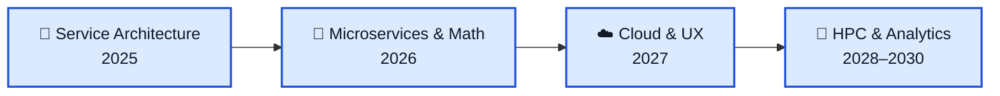

# SocialPredict

## The open prediction market engine for everyone

SocialPredict lets **anyone** – individuals, classrooms, companies, and even governments – tap into the power of prediction markets.

### Setting Up SocialPredict Website with HTTPS on a Virtual Private Computer

### SocialPredict Logging In and Creating Market

---

### Join us in shaping the future of prediction markets by building connections and expertise within your community!

## Used By

* Kenyon College (Political Science course PSCI 303, Campaigns & Elections; syllabus [here](https://www.zacharymcgee.net/syllabi/PSCI_303_public.pdf))
                        
## Stargazers over time

## Licensing

SocialPredict is available under the [MIT License](https://github.com/openpredictionmarkets/socialpredict/blob/main/LICENSE).

---

## Roadmap at a Glance

We’re building SocialPredict as the **best free prediction-market infrastructure** you can run yourself — today and into the future.

```mermaid
flowchart LR

    classDef roadmap fill:#dbeafe,stroke:#1d4ed8,color:#111827,stroke-width:2px;

    Y2025["🧩 Service Architecture<br/>2025"]
    Y2026["🧱 Microservices & Math<br/>2026"]
    Y2027["☁️ Cloud & UX<br/>2027"]
    Y2030["🚀 HPC & Analytics<br/>2028–2030"]

    Y2025 --> Y2026 --> Y2027 --> Y2030

    class Y2025,Y2026,Y2027,Y2030 roadmap
```

---

## Staging

Check out our staging instance at [kconfs.com](https://kconfs.com/) to see the newest `main` branch deployment in action. This environment may be reset, load tested, or temporarily unavailable while we test deployment and capacity changes.

Our model office / production-style release target is [brierfoxforecast.com](https://brierfoxforecast.com/). This environment is intended to track published releases rather than every merge to `main`.

## Feature Highlights

### Moderator Mode

SocialPredict now supports a moderator-driven market workflow. Approved moderators can propose markets, while admins retain final publishing control. Proposed markets are not tradable until an admin approves them.

Highlights:

- Moderator approval/status management
- Proposed, published, and rejected market lifecycle states
- Proposal cost accounting and refund behavior for rejected proposals
- Moderator profile tabs for proposed, published, and rejected markets
- Admin review queues for proposed, approved, and rejected markets
- Full market descriptions and custom YES/NO labels shown during review

> Screenshot placeholder: moderator profile with proposed/published/rejected market tabs

> Screenshot placeholder: admin market review queue showing custom labels and full description controls

### Admin and CMS Tools

Admins have expanded operational controls for reviewing users, reviewing proposed markets, and managing public sharing metadata.

Highlights:

- Admin user queue for moderator eligibility/status review
- Market review tools with approval, rejection, review trail, and refund behavior
- CMS-managed social share title, description, image, and image-enable setting
- Default OpenGraph/social share image support

> Screenshot placeholder: admin dashboard user queue

> Screenshot placeholder: admin social share / CMS settings tab

### Sharing and Embeddable Markets

Market pages now have a stronger sharing foundation, including OpenGraph and Twitter card metadata for link previews. The embeddable-market feature plan is documented so individual markets can be shared and embedded more cleanly as that work continues.

Highlights:

- Market-aware OpenGraph metadata
- Social share image endpoint and default image
- Security-header updates needed for controlled embedding
- Feature planning for iframe-friendly market embeds

> Screenshot placeholder: market detail page with share preview or social card validation

### Load Testing and Release Dossiers

The repository now includes an external load-testing harness under [`loadtest/`](./loadtest/README.md). It uses k6 from a separate load-generator machine and can seed remote staging fixtures, pull fixture CSVs, run smoke/baseline/hot-market tests, and capture host telemetry through HostOps.

Current staging capacity evidence is summarized in the [staging load-test dossier](./loadtest/dossier/staging-capacity-2026-05-29.md).

Highlights:

- k6 smoke, baseline, hot-market burst, and soak scenarios
- Remote staging fixture seeding and fixture pull commands
- Host telemetry capture for CPU, RAM, disk, network, Docker, backend, Postgres, and Traefik
- Host profile capture to record the exact tested Droplet shape and Docker/container limits
- Release dossier tooling for turning load-test results into reviewable evidence

Example dossier: [Staging Capacity Dossier, 2026-05-29](./loadtest/dossier/staging-capacity-2026-05-29.md). Look for the most recent dossier before making deployment or sizing decisions, because capacity results depend on the exact release, host size, database topology, and rate-limit configuration under test.

## Getting Started

### Setting up a Local Instance

- [Info on Local Setup](/README/LOCAL_SETUP.md)
- [Info on How Economics Can Be Customized](/README/README-CONFIG.md)
- Development fixture helpers are available through `./SocialPredict dev-bootstrap-users` for local smoke testing.

### Deploying to the Web

- [How to Set Up Your Own Website](/README/STAGE_SETUP.md)
- [HostOps Scaffold and Infra Boundary Notes](/README/INFRA/README-INFRA-HOSTOPS.md)
- [Staging Deployment Guide](/README/INFRA/README-INFRA-STAGING.md)
- [Production Deployment Guide](/README/INFRA/README-INFRA-PRODUCTION.md)

OpenPredictionMarkets deployment conventions:

- Merges to `main` deploy staging at [kconfs.com](https://kconfs.com/).
- Published GitHub releases deploy the model office / production-style target at [brierfoxforecast.com](https://brierfoxforecast.com/).
- GitHub Actions dispatch Ansible-based deploys and then verify public `/health` and `/readyz`.
- HostOps is a local convenience wrapper for host SSH, environment discovery, disk checks, cleanup, and load-test telemetry support.

### API, Operations, and Load Testing

- [Canonical Backend API documentation](/backend/docs/README.md)
- [Load Testing Guide](/loadtest/README.md)
- [Load Test CLI Runbook](/loadtest/cli/OPERATING.md)
- [Current Staging Capacity Dossier](/loadtest/dossier/staging-capacity-2026-05-29.md)

### How Do Prediction Markets Work?

Here's a quick primer about how (and why) [prediction markets work](/README/MATH/README-MATH.md). Want more info? We maintain a list of resources where you can see research on [prediction markets in action](https://github.com/openpredictionmarkets/resources).

## Contributing

We welcome and appreciate every contribution. Get started by reading our [guide](https://github.com/openpredictionmarkets/socialpredict/blob/main/CONTRIBUTING.md) and make sure to follow our [Code of Conduct](https://github.com/openpredictionmarkets/socialpredict/blob/main/CODE_OF_CONDUCT.md).

### Where to Next?

- Brush up on our [Development Conventions](/README/README-CONVENTIONS.md)
- Review the canonical [Backend API documentation](/backend/docs/README.md)
- Check out our [ongoing Projects](https://github.com/openpredictionmarkets/socialpredict/projects?query=is%3Aopen)
- Look at our [Issues](https://github.com/openpredictionmarkets/socialpredict/issues)
- Have your say on [GitHub Discussions](https://github.com/orgs/openpredictionmarkets/discussions)
