# SocialPredict

## The open prediction market engine for everyone

SocialPredict lets **anyone** – individuals, classrooms, companies, and even governments – tap into the power of prediction markets.

---

## Roadmap at a Glance

We’re building SocialPredict as the **best free prediction-market infrastructure** you can run yourself — today and into the future.

```mermaid
flowchart LR

    classDef roadmap fill:#dbeafe,stroke:#1d4ed8,color:#111827,stroke-width:2px;

    Y2025["🧩 Service Architecture<br/>2025"]
    Y2026["🧱 Microservices & Math<br/>2026"]
    Y2027["☁️ Cloud & UX<br/>2027"]
    Y2030["🚀 HPC & Analytics<br/>2028–2030"]

    Y2025 --> Y2026 --> Y2027 --> Y2030

    class Y2025,Y2026,Y2027,Y2030 roadmap
```

---

## Staging

Check out our staging instance at [BrierFoxForecast](https://brierfoxforecast.com/) to see what our software looks like in action. May be down if we are testing something.

## Getting Started

### Setting up a Local Instance

- [Info on Local Setup](/README/LOCAL_SETUP.md)
- [Info on How Economics Can Be Customized](/README/README-CONFIG.md)

### Deploying to the Web

- [How to Set Up Your Own Website](/README/STAGE_SETUP.md)

### How Do Prediction Markets Work?

Here's a quick primer about how (and why) [prediction markets work](/README/MATH/README-MATH.md). Want more info? We maintain a list of resources where you can see research on [prediction markets in action](https://github.com/openpredictionmarkets/resources).

## Contributing

We welcome and appreciate every contribution. Get started by reading our [guide](https://github.com/openpredictionmarkets/socialpredict/blob/main/CONTRIBUTING.md) and make sure to follow our [Code of Conduct](https://github.com/openpredictionmarkets/socialpredict/blob/main/CODE_OF_CONDUCT.md).

### Where to Next?

- Brush up on our [Development Conventions](/README/README-CONVENTIONS.md)
- Check out our [ongoing Projects](https://github.com/openpredictionmarkets/socialpredict/projects?query=is%3Aopen)
- Look at our [Issues](https://github.com/openpredictionmarkets/socialpredict/issues)
- Have your say on [GitHub Discussions](https://github.com/orgs/openpredictionmarkets/discussions)

#### Note

SocialPredict is designed to be performant on 64-bit systems. If you get it up and running on a 32-bit system, or you're trying to, let us know!

### Join us in shaping the future of prediction markets by building connections and expertise within your community!

## Used By

* Kenyon College (Political Science course PSCI 303, Campaigns & Elections; syllabus [here](https://www.zacharymcgee.net/syllabi/PSCI_303_public.pdf))
                        
## Stargazers over time

## Licensing

SocialPredict is available under the [MIT License](https://github.com/openpredictionmarkets/socialpredict/blob/main/LICENSE).
