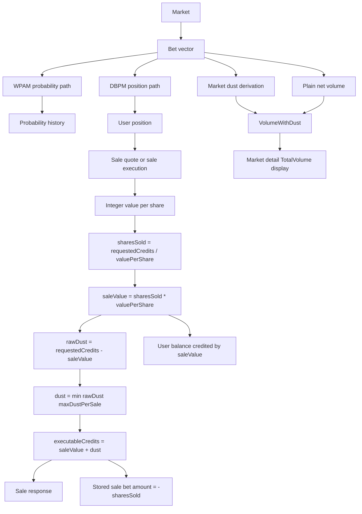

# Market Position, Dust, And Volume Flows

This document traces how raw market activity becomes user positions, sale dust,
and displayed market volume. It is meant to sit beside the broader math notes and
make the current accounting paths explicit.

## Core Objects

| Object | Meaning |
|---|---|
| Market | The contract being traded, including creation time and initial settings. |
| Bet vector | Chronological list of buys and sells for a market. Buys are positive amounts; sells are stored as negative share counts. |
| User position | The user's current YES/NO share ownership and current mark-to-market value. |
| Sale Order | A user request to sell for a credit amount. |
| Transaction-time dust | The whole-share rounding remainder retained by the market during a sale. |
| Market dust | A derived market-level dust value shown on market views. |
| Market volume | The displayed volume for a market. |

## Directed Flow



## Position Calculation

The position calculation is separate from the transaction-time dust calculation.
The dust work in the sell flow does not redesign the existing position math.

Current position math takes the market and its bet vector, then derives the
current user position used by the sell flow:

```text
market + bet vector + username -> user position
```

That broader position derivation may be `O(n)` over relevant market bet history
when it must derive the current position from historical bets.

## Sale Dust Calculation

Once the current user position is available, transaction-time sale dust is
constant-time:

```text
valuePerShare     = position.Value / sharesOwned
sharesToSell      = requestedCredits / valuePerShare
saleValue         = sharesToSell * valuePerShare
rawDust           = requestedCredits - saleValue
dust              = min(rawDust, maxDustPerSale)
executableCredits = saleValue + dust
```

Complexity:

```text
O(1) time
O(1) memory
```

The implementation does not replay market history and does not perform an
iterative downward search. Integer division finds the whole-share sale value
directly, then the dust cap clamps the executable Sale Order to the highest
allowed amount at or below the user's requested amount.

## Worked Dust Scenarios

These scenarios mirror the actual mixed-history coverage in
`TestServiceSell_ActualMixedMarketHistorySaleOrderDustScenarios`.

Shared bet history:

| Order | User | Outcome | Amount |
|---:|---|---|---:|
| 1 | alice | YES | 10 |
| 2 | bob | NO | 10000 |
| 3 | carol | NO | 10000 |
| 4 | dave | YES | 50000 |
| 5 | erin | YES | 50000 |

Alice's resulting YES position:

| Field | Value |
|---|---:|
| YES shares owned | 20 |
| Position value | 8350 |
| Integer value per share | 417 |

### Dust Exactly 1

`maxDustPerSale = 1`

| User | Outcome Sold | Requested Sale Order | Executable Sale Order |
|---|---|---:|---:|
| alice | YES | 1252 | 1252 |

Expected result:

| Field | Value |
|---|---:|
| Shares sold | 3 |
| Sale value credited | 1251 |
| Dust fee | 1 |
| Stored bet amount | -3 |

Why:

```text
3 * 417 = 1251
1252 - 1251 = 1 dust
```

### Raw Dust Greater Than 1, Rounded To 1

`maxDustPerSale = 1`

| User | Outcome Sold | Requested Sale Order | Executable Sale Order |
|---|---|---:|---:|
| alice | YES | 1255 | 1252 |

Expected result:

| Field | Value |
|---|---:|
| Shares sold | 3 |
| Sale value credited | 1251 |
| Raw remainder | 4 |
| Dust fee | 1 |
| Stored bet amount | -3 |

Why:

```text
1255 - 1251 = 4 raw dust
min(4, 1) = 1 dust
1251 + 1 = 1252 executable credits
```

### Raw Dust Greater Than 1, Rounded To 0

`maxDustPerSale = 0`

| User | Outcome Sold | Requested Sale Order | Executable Sale Order |
|---|---|---:|---:|
| alice | YES | 1255 | 1251 |

Expected result:

| Field | Value |
|---|---:|
| Shares sold | 3 |
| Sale value credited | 1251 |
| Raw remainder | 4 |
| Dust fee | 0 |
| Stored bet amount | -3 |

Why:

```text
1255 - 1251 = 4 raw dust
min(4, 0) = 0 dust
1251 + 0 = 1251 executable credits
```

## Displayed Market Volume

The market detail and overview path currently displays volume with market dust:

```text
TotalVolume = VolumeWithDust(bets)
VolumeWithDust = sum(bet.Amount) + marketDust
```

The visible market response also exposes:

```text
MarketDust = marketDust
```

This is the path used by market detail/overview responses, including the market
page volume display.

## Current Volume Path Split

There are currently two volume paths:

| Path | Uses dust? | Current behavior |
|---|---|---|
| Market detail/overview `TotalVolume` | Yes | Uses `VolumeWithDust = sum(bet.Amount) + marketDust`. |
| Plain `CalculateMarketVolume` and some analytics paths | No | Uses `sum(bet.Amount)` only. |

This split is a design risk because two callers can ask "what is market volume?"
and receive different answers depending on which path they use.

## Current Market Dust Convention

Transaction-time sale dust is exact for the current sale response.

Historical market dust is currently stateless and derived without a persisted
dust column. The current convention counts one retained dust unit per historical
sell row:

```text
marketDust = count(historical sell rows)
```

This keeps the model stateless, but it is only an approximation of exact
historical transaction-time dust. A historical sell that originally had zero dust
is still counted as one dust unit by the current market dust convention.

## Recommended Convergence

The volume paths should be converged behind one explicit market accounting
snapshot so all callers use the same policy:

```text
MarketAccountingSnapshot {
  netBetVolume
  marketDust
  volumeWithDust
}
```

Recommended follow-up:

| Step | Purpose |
|---:|---|
| 1 | Define one domain-level market accounting calculator for net volume, dust, and volume-with-dust. |
| 2 | Route market detail, overview, analytics, and plain `CalculateMarketVolume` through that calculator. |
| 3 | Decide whether historical market dust should remain the simple stateless sell-row convention or replay the sell history to derive exact zero-or-one dust per sale. |
| 4 | Add tests proving all public volume callers return the same intended volume policy. |

