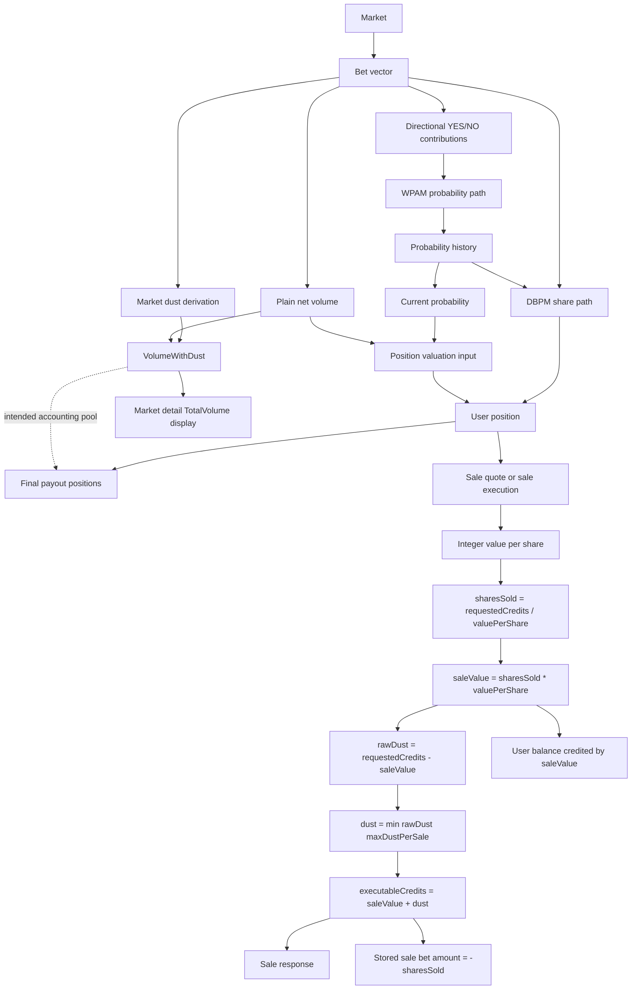

# Market Position, Dust, And Volume Flows

This document traces how raw market activity becomes user positions, sale dust,
and displayed market volume. It is meant to sit beside the broader math notes and
make the current accounting paths explicit.

## Core Objects

| Object | Meaning |
|---|---|
| Market | The contract being traded, including creation time and initial settings. |
| Bet vector | Chronological list of buys and sells for a market. Buys are positive amounts; sells are stored as negative share counts. |
| User position | The user's current YES/NO share ownership and current mark-to-market value. |
| Sale Order | A user request to sell for a credit amount. |
| Transaction-time dust | The whole-share rounding remainder retained by the market during a sale. |
| Market dust | A derived market-level dust value shown on market views. |
| Market volume | The displayed volume for a market. |

## Directed Flow



The important distinction is that the WPAM probability path receives directional
YES/NO contributions from the bet vector. It does not receive market dust or
displayed `TotalVolume`.

Probability history does feed the DBPM share path. In the current code, the
position pipeline first calculates WPAM probability changes from the ordered bet
vector, then passes that probability history into DBPM:

```text
sorted bets -> WPAM probability history
sorted bets + WPAM probability history -> DBPM net positions
```

DBPM uses the probability history in two ways:

| DBPM step | Probability input |
|---|---|
| Pool share division | Current/final probability from the probability history. |
| Course payout calculation | Probability at the time each bet was placed. |

The current probability from that same history is also used by the valuation
step after DBPM has produced the user's YES/NO share position.

Plain net volume is shown separately because current position valuation and some
analytics paths use the net bet volume. Market dust is shown separately because
the market page can display both the retained dust and the total accounting
volume:

```text
displayed TotalVolume = plain net volume + market dust
```

The dotted edge from `VolumeWithDust` to final payout positions is an intended
accounting relationship, not a statement that the market detail display itself is
the source of payout truth. Display fields should never be used as the canonical
input to final payout. Instead, both display and payout should derive from the
same underlying accounting snapshot.

## Dust, Probability, And Human Preference

Dust is user-originated capital, but it is not directional user intent.

WPAM probability is intended to represent the directional preference signal in
the market: how much users intentionally put behind YES versus NO, and how much
exposure they intentionally remove through sell rows. Dust is different. Dust is
a whole-credit rounding remainder retained by the market during sale settlement
because integer accounting cannot always return the exact requested sale amount.

Therefore, the current design keeps these concepts separate:

| Quantity | Meaning | Affects WPAM probability? |
|---|---|---|
| Buy amount | Intentional directional belief or liquidity. | Yes |
| Sell row | Intentional reduction of directional exposure. | Yes |
| Transaction-time dust | Rounding remainder from integer sale settlement. | No |
| Display/accounting volume with dust | Capital retained in the market for accounting visibility. | No, not directly |

This can be summarized as:

```text
Probability = directional preference signal
Volume/accounting = capital retained in the market
```

Dust can be understood as previous human capital, but not previous human
directional intention. Including dust in WPAM would require assigning it to YES,
NO, or some proportional side allocation. That allocation would be arbitrary and
could let small rounding artifacts move probability even when no user intended a
new probability movement.

For that reason, excluding dust from WPAM is justified. The follow-up consistency
question is not whether dust should move probability; it is how all position,
payout, display, and analytics paths should consistently treat retained dust as
accounting volume.

## Dust, Integer Accounting, And Money Conservation

SocialPredict uses integer credits rather than floating-point balances. This
avoids floating-point precision drift in user balances, market volume, and final
payouts, but it also means some sale requests cannot be represented exactly when
share values are converted back into whole credits.

Dust is the retained integer remainder from that conversion:

```text
saleValue = sharesSold * valuePerShare
dust = executableCredits - saleValue
```

The purpose of retaining dust in market accounting is to preserve conservation:

```text
money in = money out + money still retained by the market
```

Without a retained-dust convention, the platform risks either losing integer
remainders or creating credits from nowhere when resolving or displaying market
accounting. Dust is therefore an accounting mechanism, not a probability signal.

The desired conservation model is:

| Concept | Role |
|---|---|
| User sale credit | Credits returned to the seller. |
| Dust | Credits retained by the market due to whole-share rounding. |
| Accounting volume with dust | Pool used to explain where retained market value lives. |
| Probability | Directional preference signal, excluding dust. |

Current implementation note: market detail display uses `VolumeWithDust`, but
the final payout/position pipeline currently derives payout positions through
`CalculateMarketPositions_WPAM_DBPM`, whose DBPM volume path uses plain
`GetMarketVolume`. That means the code does not yet fully express the intended
"one accounting snapshot" model for dust-aware conservation.

## Position Calculation

The position calculation is separate from the transaction-time dust calculation.
The dust work in the sell flow does not redesign the existing position math.

Current position math takes the market and its bet vector, then derives the
current user position used by the sell flow:

```text
market + bet vector + username -> user position
```

That broader position derivation may be `O(n)` over relevant market bet history
when it must derive the current position from historical bets.

## Sale Dust Calculation

Once the current user position is available, transaction-time sale dust is
constant-time:

```text
valuePerShare     = position.Value / sharesOwned
sharesToSell      = requestedCredits / valuePerShare
saleValue         = sharesToSell * valuePerShare
rawDust           = requestedCredits - saleValue
dust              = min(rawDust, maxDustPerSale)
executableCredits = saleValue + dust
```

Complexity:

```text
O(1) time
O(1) memory
```

The implementation does not replay market history and does not perform an
iterative downward search. Integer division finds the whole-share sale value
directly, then the dust cap clamps the executable Sale Order to the highest
allowed amount at or below the user's requested amount.

## Worked Dust Scenarios

These scenarios mirror the actual mixed-history coverage in
`TestServiceSell_ActualMixedMarketHistorySaleOrderDustScenarios`.

Shared bet history:

| Order | User | Outcome | Amount |
|---:|---|---|---:|
| 1 | alice | YES | 10 |
| 2 | bob | NO | 10000 |
| 3 | carol | NO | 10000 |
| 4 | dave | YES | 50000 |
| 5 | erin | YES | 50000 |

Alice's resulting YES position:

| Field | Value |
|---|---:|
| YES shares owned | 20 |
| Position value | 8350 |
| Integer value per share | 417 |

### Dust Exactly 1

`maxDustPerSale = 1`

| User | Outcome Sold | Requested Sale Order | Executable Sale Order |
|---|---|---:|---:|
| alice | YES | 1252 | 1252 |

Expected result:

| Field | Value |
|---|---:|
| Shares sold | 3 |
| Sale value credited | 1251 |
| Dust fee | 1 |
| Stored bet amount | -3 |

Why:

```text
3 * 417 = 1251
1252 - 1251 = 1 dust
```

### Raw Dust Greater Than 1, Rounded To 1

`maxDustPerSale = 1`

| User | Outcome Sold | Requested Sale Order | Executable Sale Order |
|---|---|---:|---:|
| alice | YES | 1255 | 1252 |

Expected result:

| Field | Value |
|---|---:|
| Shares sold | 3 |
| Sale value credited | 1251 |
| Raw remainder | 4 |
| Dust fee | 1 |
| Stored bet amount | -3 |

Why:

```text
1255 - 1251 = 4 raw dust
min(4, 1) = 1 dust
1251 + 1 = 1252 executable credits
```

### Raw Dust Greater Than 1, Rounded To 0

`maxDustPerSale = 0`

| User | Outcome Sold | Requested Sale Order | Executable Sale Order |
|---|---|---:|---:|
| alice | YES | 1255 | 1251 |

Expected result:

| Field | Value |
|---|---:|
| Shares sold | 3 |
| Sale value credited | 1251 |
| Raw remainder | 4 |
| Dust fee | 0 |
| Stored bet amount | -3 |

Why:

```text
1255 - 1251 = 4 raw dust
min(4, 0) = 0 dust
1251 + 0 = 1251 executable credits
```

## Displayed Market Volume

The market detail and overview path currently displays volume with market dust:

```text
TotalVolume = VolumeWithDust(bets)
VolumeWithDust = sum(bet.Amount) + marketDust
```

The visible market response also exposes:

```text
MarketDust = marketDust
```

This is the path used by market detail/overview responses, including the market
page volume display.

## Current Volume Path Split

There are currently two volume paths:

| Path | Uses dust? | Current behavior |
|---|---|---|
| Market detail/overview `TotalVolume` | Yes | Uses `VolumeWithDust = sum(bet.Amount) + marketDust`. |
| Plain `CalculateMarketVolume` and some analytics paths | No | Uses `sum(bet.Amount)` only. |

This split is a design risk because two callers can ask "what is market volume?"
and receive different answers depending on which path they use.

## Current Market Dust Convention

Transaction-time sale dust is exact for the current sale response.

Historical market dust is currently stateless and derived without a persisted
dust column. The current convention counts one retained dust unit per historical
sell row:

```text
marketDust = count(historical sell rows)
```

This keeps the model stateless, but it is only an approximation of exact
historical transaction-time dust. A historical sell that originally had zero dust
is still counted as one dust unit by the current market dust convention.

## Recommended Convergence

The volume paths should be converged behind one explicit market accounting
snapshot so all callers use the same policy:

```text
MarketAccountingSnapshot {
  netBetVolume
  marketDust
  volumeWithDust
}
```

Recommended follow-up:

| Step | Purpose |
|---:|---|
| 1 | Define one domain-level market accounting calculator for net volume, dust, and volume-with-dust. |
| 2 | Route market detail, overview, analytics, and plain `CalculateMarketVolume` through that calculator. |
| 3 | Decide whether historical market dust should remain the simple stateless sell-row convention or replay the sell history to derive exact zero-or-one dust per sale. |
| 4 | Add tests proving all public volume callers return the same intended volume policy. |
