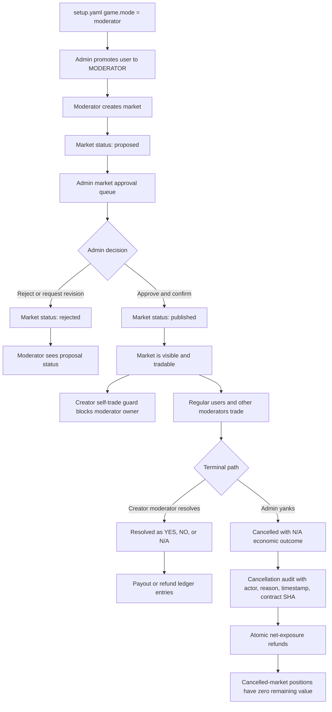
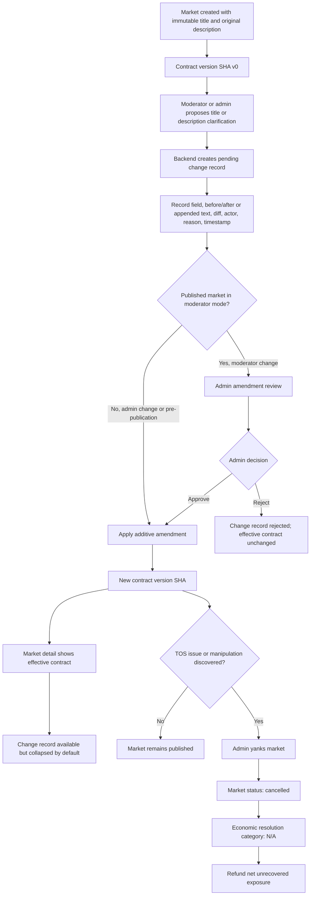

# Moderator Mode

## Purpose

SocialPredict currently behaves as an open market-creation game: authenticated users can create markets, trade on markets, and the market creator can resolve the market.

Moderator mode adds a second game mode where market creation is limited to a moderator user class and newly created moderator markets must pass through admin approval before they are published and tradable.

This note is a feature-level spec. Backend and frontend implementation notes should reference it, but this document is intentionally not owned by either layer.

## Feature Artifact Map

This directory keeps the moderator-mode feature work together:

- [01-moderators.md](./01-moderators.md): feature overview, product behavior, and acceptance criteria.
- [DESIGN.md](./DESIGN.md): domain and architecture design artifact aligned with the canonical design plan.
- [PLAN.md](./PLAN.md): implementation sequencing and PR slicing plan derived from the design.
- [FUTURE-GAME-ENGINE.md](./FUTURE-GAME-ENGINE.md): later game-engine triage note for when direct domain policy becomes too scattered.

## Game Mode Configuration

Moderator mode should be configured through the game setup policy served by the setup service. The default mode must remain open so existing games keep their current behavior unless explicitly configured otherwise.

Proposed `setup.yaml` shape:

```yaml
game:
  mode: open # open | moderator
  moderation:
    marketApprovalRequired: true
    moderatorCanTrade: true
    moderatorCanTradeOwnMarkets: false
    adminCanYankMarkets: true
```

The setup service should expose this policy in the same immutable application-policy snapshot as economics and frontend policy. Runtime behavior should not depend on hidden globals or frontend-only flags.

## Current Code Reality

The current code has useful pieces, but it does not yet implement moderator mode.

- `backend/setup/setup.yaml` currently defines economics and frontend chart policy only. There is no game-mode or moderation policy section yet.
- `backend/internal/service/config/types.go` mirrors setup policy into service config. It must be extended with game-mode policy before handlers or domain services can enforce this consistently.
- `backend/internal/domain/users/models.go` has a `UserType` string, but no first-class moderator role constants, moderator status, or suspension fields.
- `backend/internal/domain/markets/service_policies.go` creates markets as `active` immediately. There is no pending approval state or admin approval queue.
- Market title and description are currently modeled as ordinary market fields. There is no append-only contract history, contract version reference, or backend-generated change record.
- Market resolution currently requires the resolver username to match `market.CreatorUsername`. Moderator mode can keep creator-owned resolution for moderator-created markets, but must also account for suspended moderators and cancelled markets.
- `ResolveMarket(..., "N/A")` already triggers a refund path through `TransactionRefund`, but that is not the same thing as an admin market yank. The feature needs an explicit cancellation state and tests for partial sell-outs before relying on the existing refund math.
- `backend/internal/repository/markets/repository.go` has a `Delete` path that hard-deletes a market. Admin yanks must not use hard delete, because cancellation requires auditability and ledger correctness.

## Roles And Permissions

### Regular User

In open mode, regular users keep the current ability to create and trade on markets.

In moderator mode, regular users can trade on published markets but cannot create markets or publish markets.

### Moderator

A moderator is an elevated game participant, not an admin.

Moderators can:

- create proposed markets
- resolve published markets they created
- trade on published markets they did not create
- view their own proposed, rejected, published, resolved, and cancelled markets

Moderators cannot:

- trade on their own markets
- approve or reject markets
- publish their own proposed markets
- yank or cancel markets
- promote, demote, suspend, or unsuspend users
- create, resolve, or trade while suspended

Suspension should immediately block moderator-only actions. Existing published markets created by that moderator should remain visible, but admins must be able to yank them if the suspension is tied to bad-market or abuse concerns.

### Admin

Admins retain platform-level control.

Admins can:

- view all users
- promote regular users to moderators
- demote moderators if demotion is supported
- suspend and unsuspend moderators
- approve or reject proposed markets
- require a confirmation action before approval
- yank or cancel published markets
- supply reasons for moderator suspension, rejection, and cancellation

Admin actions should be auditable with actor, target, reason, timestamp, and before/after state.

## Market Lifecycle

Moderator mode adds an approval lifecycle before a market becomes tradable.

Recommended lifecycle:

1. `proposed`: moderator has created the market; it is not listed as tradable.
2. `rejected`: admin rejected the proposal; it remains visible to the creator and admins for audit/history.
3. `published`: admin approved the proposal; the market is visible and tradable.
4. `closed`: market is no longer accepting trades because the resolution time passed or it was closed by policy.
5. `resolved`: the creator moderator resolved the market and payouts/refunds were applied.
6. `cancelled`: admin yanked the market and cancellation refunds were applied.

Existing public statuses such as `active`, `closed`, and `resolved` can remain for compatibility, but the system needs an approval status or equivalent lifecycle state so pending markets are not exposed as tradable active markets.

## Flow Diagrams

### Moderator Market Flow



### Contract Amendment And Cancellation Flow



## Market Contract Immutability

Moderator mode should treat a market as a contract with append-only history.

The original title is immutable. No backend path should overwrite the market title after creation. If a title needs clarification, correction, or an additional qualifier, the system should create a title amendment in the market change record instead of replacing the original title.

The original description should also not be overwritten in place. Descriptions often need clarifying resolution criteria over time, but those clarifications must be additive. The displayed contract should be the original description plus approved clarification entries in timestamp order.

Conceptually, every market should expose three contract fields:

1. `title`: the original immutable title.
2. `description`: the original description plus additive clarifications.
3. `changeRecord`: the ordered amendment history for title, description, and other contract-impacting changes.

The `changeRecord` should be generated by the backend. Clients should not be trusted to supply their own audit history.

Each change record entry should include:

- market ID
- contract version reference SHA
- previous contract version reference SHA
- actor username and role
- timestamp
- changed field
- before value or previous text reference
- after value or appended text
- machine-readable diff where practical
- human-readable reason
- approval actor and timestamp when approval is required

Any approved title or description amendment should produce a new contract version reference SHA. That reference gives admins, moderators, traders, and tests a stable way to point at exactly which version of the market contract was visible at a given time.

For frontend presentation, the change record should be available from the market detail view but collapsed behind an explicit click by default. It is important audit data, but showing it fully expanded for every market would add too much noise.

Published-market contract amendments should require admin approval in moderator mode unless the actor is an admin. That keeps moderators from bypassing the proposed-market queue by publishing a clean market and later appending TOS-violating or materially different contract text.

## Approval Queue

Moderator-created markets enter an admin-visible queue before publication.

The admin approval queue should show:

- market title, description, labels, outcome type, and resolution time
- creator username and moderator status
- creation timestamp
- prior rejection or revision history if present
- admin actions: approve, reject, request revision, view creator profile

Approval must be a two-step action:

1. Admin clicks approve.
2. Admin confirms approval in a verification prompt.

After approval, the market becomes published/tradable and moves out of the incoming proposal queue.

## Moderator Dashboard

Moderators need a dashboard focused on the markets they created.

The dashboard should include:

- proposed markets awaiting admin review
- rejected or revision-requested markets
- published active markets
- closed markets awaiting resolution
- resolved markets
- cancelled/yanked markets

Moderators should not need admin dashboard access to understand whether their proposed markets are pending, published, rejected, or cancelled.

## Admin Dashboards

Moderator mode needs three admin views.

### Users Dashboard

The users dashboard should show all users, including:

- username
- display name
- user type
- account status
- moderator status if applicable
- promote-to-moderator action

### Moderators Dashboard

The moderators dashboard should show only moderators and moderator candidates as needed.

It should include:

- moderator status: active or suspended
- suspension reason and timestamp
- created market counts by lifecycle state
- suspend and unsuspend actions
- demote action if supported

### Market Approval Dashboard

The market approval dashboard should show incoming proposed markets and previously handled proposals.

It should include:

- pending proposed markets
- approved/published markets
- rejected markets
- cancelled/yanked markets
- approve, reject, request revision, and yank actions where state permits

## Admin Yank And Refund Policy

Admins must be able to yank a published market when it is bad, abusive, malformed, or otherwise unsafe to keep active.

The economic outcome for a yanked market can be represented as `N/A`, using the same high-level outcome category as an unresolvable market. The product state should still distinguish an admin yank from an ordinary creator resolution by storing the cancellation actor, reason, timestamp, and contract version reference SHA that triggered the decision.

Common yank reasons include:

- TOS-violating title or description amendment
- materially misleading clarification
- suspected market manipulation
- malformed or unresolvable criteria
- moderator abuse or compromised moderator account

Yanking a market should:

- move the market into a terminal `cancelled` state
- prevent any further buys, sells, or resolution
- create an auditable cancellation event
- reference the contract version or change record that caused the cancellation when applicable
- issue refund ledger entries in a single atomic operation
- reduce all remaining position/share value for that market to zero
- preserve the market row and all ledger history

The refund rule should be:

- refund money paid into the market by each user
- subtract value already recovered by selling out
- leave no remaining claim value on the cancelled market

The current `N/A` resolution refund path is a starting point, not final proof. It refunds listed bets through `TransactionRefund`, while sell proceeds are recorded through `TransactionSale`. Before using that math for admin yanks, add a Postgres-backed test that covers:

- one user buys and never sells
- one user buys, partially sells, then the market is yanked
- one user buys, fully sells out, then the market is yanked
- multiple users on both outcomes
- cancellation is atomic with the market state update
- the final account balances equal original balance minus net unrecovered exposure
- all cancelled-market positions have zero remaining value

This test should be DSN-gated like the existing Postgres truth tests so it proves repository behavior, not only fake-backed domain behavior.

## Domain Policy

Moderator mode should be enforced in domain services, not only in UI routing.

Required checks:

- market creation checks game mode and user role
- market creation by moderators creates `proposed`, not `published`
- market title cannot be overwritten after creation
- market description cannot be overwritten after creation
- title and description clarifications must be append-only contract amendments
- contract amendments create backend-generated change records and new contract version references
- published-market amendments require admin approval in moderator mode unless performed by an admin
- suspended moderators cannot create or resolve markets
- pending and rejected markets cannot be traded on
- cancelled markets cannot be traded on or resolved
- moderator-created markets cannot be traded on by their creator in moderator mode
- approval requires admin authorization
- cancellation requires admin authorization

The self-trade guard belongs in the betting service path for both buy and sell operations so API clients cannot bypass it.

## API Surface

The exact routes can follow existing route conventions, but the feature needs these capabilities.

Admin APIs:

- `GET /v0/admin/users`
- `PATCH /v0/admin/users/{username}/role`
- `GET /v0/admin/moderators`
- `PATCH /v0/admin/moderators/{username}/suspension`
- `GET /v0/admin/markets/proposed`
- `POST /v0/admin/markets/{id}/approve`
- `POST /v0/admin/markets/{id}/reject`
- `POST /v0/admin/markets/{id}/yank`

Moderator APIs:

- `GET /v0/moderator/markets`
- `GET /v0/moderator/markets/proposed`
- `GET /v0/moderator/markets/published`

Existing market APIs:

- `POST /v0/markets` should remain the creation entry point, but its result depends on game mode.
- `POST /v0/markets/{id}/amendments` should create an append-only title or description amendment rather than mutating market fields in place.
- `GET /v0/markets/{id}/change-record` should expose the ordered contract history for the market.
- `POST /v0/markets/{id}/resolve` should enforce moderator status, market ownership, and lifecycle state.
- `POST /v0/bet` and `POST /v0/sell` should reject pending, rejected, cancelled, and self-created moderator markets.

## Data Requirements

User data needs:

- stable role constants for `ADMIN`, `REGULAR`, and `MODERATOR`
- moderator status, at least `active` and `suspended`
- suspension reason, actor, and timestamp
- audit events for role and suspension changes

Market data needs:

- approval or lifecycle status
- immutable original title
- immutable original description
- effective description projection built from approved additive clarifications
- current contract version reference SHA
- proposed-by moderator username
- approved-by admin username and timestamp
- rejected-by admin username, timestamp, and reason
- cancelled-by admin username, timestamp, and reason
- a cancellation/refund event identifier tied to ledger entries

Market contract change data needs:

- market ID
- sequential amendment ID
- contract version reference SHA
- previous contract version reference SHA
- changed field
- diff or before/after references
- appended clarification text when applicable
- actor username and role
- timestamp
- reason
- approval state and approval actor when applicable

Ledger data needs:

- refund transaction type for cancellation refunds
- stable relationship between cancellation event and generated refund transactions
- enough source data to recompute or audit net exposure after buys and sells

## Rollout Plan

1. Add game-mode config to `setup.yaml`, setup parsing, and config-service translation with default `open` behavior.
2. Introduce role constants, moderator status, and role/suspension audit records.
3. Add market lifecycle support for proposed, rejected, published, resolved, and cancelled states.
4. Add immutable market contract storage and append-only change records for title and description amendments.
5. Enforce moderator-mode creation, resolution, amendment, and self-trade rules in domain services.
6. Add admin approve/reject/yank use cases and repository methods.
7. Add DSN-gated Postgres tests for cancellation refunds, including partial and full sell-out scenarios.
8. Add admin dashboards for users, moderators, market approval, and contract amendment review.
9. Add moderator dashboards for proposed and published markets.
10. Add end-to-end click testing for admin approval, moderator proposal tracking, contract amendments, trading restrictions, and cancellation refunds.

## Acceptance Criteria

Moderator mode is ready when:

- open mode remains backward compatible
- setup config can enable moderator mode without code changes
- only active moderators can create proposed markets in moderator mode
- proposed markets are not tradable until admin approval
- admin approval requires confirmation
- moderators can see their own proposed and published markets
- admins can promote, suspend, and unsuspend moderators
- suspended moderators cannot create or resolve markets
- moderators cannot trade on their own markets
- original market titles are immutable
- original market descriptions are not overwritten in place
- title and description clarifications are append-only amendments
- every contract amendment has a backend-generated change record and contract version reference SHA
- published-market amendments in moderator mode cannot bypass admin review
- admins can yank markets without hard deletion
- admin yanks can resolve economically as `N/A` while retaining cancellation-specific audit state
- yanked markets refund users according to net unrecovered exposure
- cancellation refund math is proven by Postgres-backed tests
- cancellation, refund ledger entries, and market state update are atomic

## Non-Goals

This feature does not introduce:

- automated market-quality scoring
- AI-based moderation
- a general-purpose workflow engine
- anonymous moderators
- frontend-only authorization
- hard-deleting yanked markets

## Open Questions

- Should admins be able to trade on markets in moderator mode, or should they be restricted to oversight?
- Should admins be able to approve markets they personally created if admin-created markets are supported?
- Should rejected proposals be editable and resubmittable, or should moderators create a new proposal?
- Should moderator resolution itself require admin review for certain market types?
- Should demotion from moderator preserve historical moderator attribution?
- Should cancellation reasons be public, admin-only, or visible to affected traders?
