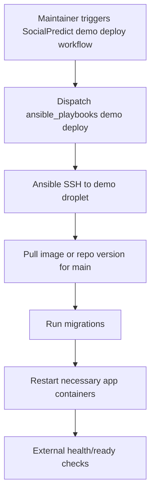
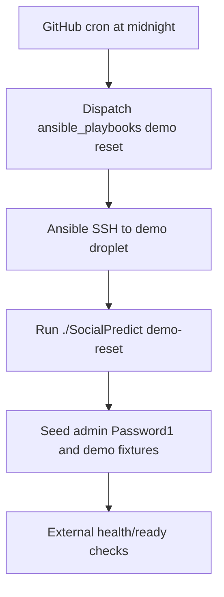

# Resettable Public Demo Design

## Purpose

This document translates [02-resettable-public-demo.md](./02-resettable-public-demo.md) into a system design for a separate, disposable public demo environment.

It is not the implementation plan. The implementation sequence lives in [PLAN.md](./PLAN.md).

## Design Inputs

Primary inputs:

- [02-resettable-public-demo.md](./02-resettable-public-demo.md)
- Canonical design plan: `spec-socialpredict-tasks-auto/lib/design/design-plan.json`
- Designer-agent postures from `spec-socialpredict-tasks-auto/.codex/agents/`
- Existing SocialPredict deployment split between this repository and `openpredictionmarkets/ansible_playbooks`

The canonical design plan remains the repository-level design source of truth. This feature design must conform to it rather than create a competing architecture.

## Designer Lens Review

Evans/domain lens:

- Demo is an environment type with a different data policy, not a variant of production.
- The ubiquitous language must distinguish `demo`, `staging`, `production`, `deploy`, `reset`, `seed`, and `fixture`.
- Public demo data is disposable by policy; production data is durable by policy.

Fowler/evolutionary lens:

- Start with a simple isolated droplet and scheduled reset before adding Terraform or a broader environment platform.
- Use existing GitHub-to-Ansible deployment patterns rather than inventing a second orchestration channel.
- Keep the app reset command narrow and reversible enough to refine once the first demo is running.

Martin/clean-architecture lens:

- Ansible should not know app table names, password hashing rules, or seed fixture internals.
- `./SocialPredict` should own application reset and seed logic because that logic depends on app policy and schema.
- GitHub workflows should orchestrate; they should not become the application boundary.

## Problem Framing

SocialPredict needs a low-risk public trial surface. Staging and production cannot serve this role because staging must validate deployments and production must preserve user data.

A resettable demo environment provides public experimentation while containing data, credential, and operational risk through environment isolation and scheduled reset.

## Business Outcomes

A resettable public demo should enable:

- Public hands-on evaluation of SocialPredict without maintainer-created accounts.
- Safe experimentation with market creation, moderation, and admin flows.
- Fast demonstration of the current `main` branch or latest approved demo build.
- Low operational burden through daily reset and deterministic fixtures.
- Clear separation between disposable public demo data and durable staging/production data.

## Out Of Scope

This design does not initially introduce:

- Terraform-managed provisioning.
- Multi-droplet high availability for demo.
- Demo data retention guarantees.
- A generic environment-management service.
- A GitHub workflow that depends on local `HostOps` keys.
- Manual SQL in Ansible for password hashing or fixture internals.

## Ubiquitous Language

| Term | Meaning | Avoid confusing with |
| --- | --- | --- |
| Demo | Disposable public environment for anyone to try the app. | Staging or production. |
| Staging | Maintainer validation environment for deployment and release checks. | Public demo. |
| Production / mo | Durable user-facing environment. | Demo or staging. |
| Deploy | Upgrade application code/images and run migrations without intentionally wiping demo data. | Reset. |
| Reset | Destructive demo-only operation that wipes or restores demo data and reseeds fixtures. | Deploy or rollback. |
| Fixture | Deterministic user, market, or configuration data created by app-owned seed/reset logic. | Real user data. |
| Demo admin | Public fixture admin account with known password in the isolated demo only. | Production admin. |
| External readiness verification | GitHub-hosted check that reaches the public demo URL after deploy/reset. | Internal Ansible task success. |

## Bounded Context Alignment

| Design-plan boundary | Demo feature ownership |
| --- | --- |
| Release and Deployment Control | Owns GitHub workflow orchestration, Ansible dispatch, scheduled reset triggers, and public readiness verification. |
| Runtime Bootstrap and Infrastructure | Owns process startup, migrations, Docker container lifecycle, and host-level runtime assumptions. |
| Configuration Service Slice | Owns app-visible environment/demo policy if any app behavior needs demo-specific configuration. |
| Repository and Legacy Model Adapter Boundary | Owns schema migration truth and app-level data reset mechanics through app code, not Ansible SQL. |
| API and Auth Contract Boundary | Owns login behavior for the demo admin after fixtures are seeded. |
| Frontend Experience Context | May present demo notices later, but does not own reset policy. |
| HostOps / Operator Convenience Boundary | May help maintainers inspect or manually connect to demo hosts, but should not be a GitHub workflow dependency. |

## Context Map

The demo environment crosses repositories and runtime boundaries:

- SocialPredict repository defines app commands, app docs, and dispatching GitHub workflows.
- Ansible repository stores remote deployment/reset playbooks and demo-scoped GitHub secrets.
- DigitalOcean owns droplet infrastructure and network-level host reachability.
- Docker owns runtime containers and demo database volume boundaries.
- `./SocialPredict` owns reset and seed semantics inside the app boundary.
- External readiness checks validate public behavior after Ansible reports completion.

## Core Design Rules

Environment isolation rules:

- Demo must use a separate droplet or equivalent isolated host.
- Demo must use separate database volumes and secrets.
- Demo reset workflows must not accept staging or production as implicit targets.
- Demo should have explicit host/domain naming in workflow logs.

Deploy rules:

- Manual demo deploy upgrades application code/images and runs migrations.
- Demo deploy should preserve the demo database unless the operator chose reset.
- Deploy success is not enough; public readiness must pass externally.

Reset rules:

- Demo reset is destructive by design.
- Reset should be owned by an app command such as `./SocialPredict demo-reset`.
- Reset should create deterministic fixtures, including the public demo admin.
- Reset should run after migrations or restore a snapshot that is compatible with the current app version.
- Reset should be schedulable and manually triggerable.

Fixture rules:

- Demo admin password may be `Password1` only in the demo environment.
- Demo admin must have `must_change_password=false`.
- Fixture creation should use the same password hashing and domain rules as normal app user creation where practical.
- Fixture logic must not be implemented as duplicated SQL in Ansible.

## Candidate Workflow Shape

Manual demo deploy:

Scheduled demo reset:

## Security And Safety

The known demo admin password is acceptable only under strict isolation.

Required safety properties:

- Demo host has no production secrets.
- Demo database contains no production data.
- Demo workflows use demo-specific secrets.
- Demo reset logs must not print private keys or hashed passwords.
- Public docs and UI should state that demo data is reset regularly.
- Firewall and SSH access should follow the existing DigitalOcean hardening pattern.

## Open Questions

- What public domain should point at the demo droplet?
- Should demo deploy from every `main` update, manual workflow only, or latest release only?
- Should reset drop/recreate Docker volumes, truncate mutable tables, or restore a known clean snapshot?
- Which fixture users and markets should exist beyond the public admin?
- Should the demo show an in-app banner explaining daily reset behavior?
- Should the reset time use UTC midnight or a project-local timezone?
