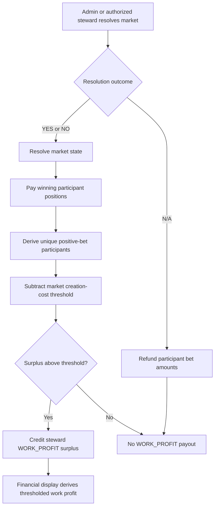

# Moderator Work Profits Design

## Design Posture

This design follows the canonical design plan's boundary posture:

- Prediction market accounting remains backend-owned domain truth.
- Financial read models are display-only and must not decide transaction outcomes.
- New economic behavior should be implemented at explicit service-policy seams.
- Additive persistence is preferred when state is required; this baseline avoids new persistence because the existing market and bet tables are sufficient.

## Domain Language

| Term | Meaning |
| --- | --- |
| Market creator | Immutable user who created the market and paid the proposal/creation cost. |
| Steward | Current operational owner who can govern the market; not necessarily the creator. |
| Initial entry fee | Existing first-positive-bet fee charged once per user per market. |
| Work income | Surplus entry-fee income credited to the current steward/resolver after normal resolution payout. |
| Work profit | Thresholded surplus value: unique participant fees minus the market creation/proposal cost, floored at zero. |

## Payout Timing



## Derivation

Work income is derived from canonical market bet history at resolution time:

- Count each username once when they have at least one positive bet on the market.
- Ignore sell rows and zero-value rows.
- Ignore repeated buy rows from the same user.
- Multiply unique participant count by `InitialBetFee`.
- Subtract the market creation/proposal cost threshold.
- Floor the result at zero.

Financial display separately computes net work profit:

```text
workProfits = sum(resolved stewarded markets) {
  max(uniquePositiveParticipants * InitialBetFee - marketCreationThreshold, 0)
}
```

If a legacy market has no stored proposal cost, display logic falls back to the current `CreateMarketCost` config.

The threshold applies to the market, not only to the creator. If stewardship is reassigned, the new steward can earn work profit, but only after the market's participant fees exceed the creation-cost threshold.

## Critical Decisions

| Decision | Uses cached/read-model data? | Reason |
| --- | --- | --- |
| Winner payout | No | Must use canonical market state and payout positions. |
| Work-profit payout | No | Must use canonical bet history and market creation-cost threshold at resolution time. |
| Balance mutation | No | User balance writes are transaction truth. |
| Retained participation-fee metric | No | Only surplus above threshold is redistributed as work income; threshold fees remain retained participation fees. |
| User financial display | May use read models | Display-only summary can be stale, but must be marked as such. |

## Out Of Scope

- Changing steward attribution after resolution. Steward reassignment is blocked once resolved so stateless derivation remains stable.
- Paying work income on `N/A` refund resolutions.
- Adding durable per-market initial-fee policy capture.
- Changing how initial entry fees are charged during bet placement.
