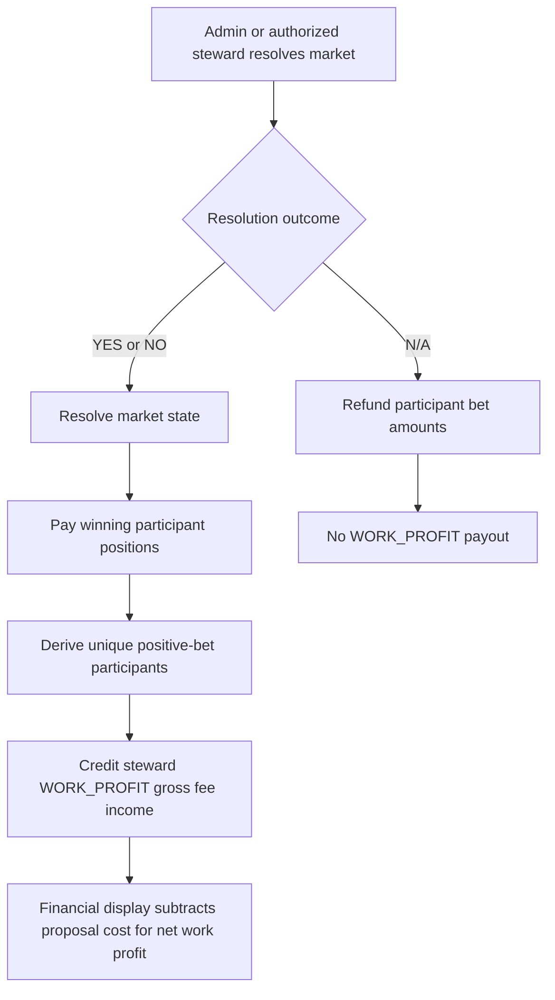

# Moderator Work Profits Design

## Design Posture

This design follows the canonical design plan's boundary posture:

- Prediction market accounting remains backend-owned domain truth.
- Financial read models are display-only and must not decide transaction outcomes.
- New economic behavior should be implemented at explicit service-policy seams.
- Additive persistence is preferred when state is required; this baseline avoids new persistence because the existing market and bet tables are sufficient.

## Domain Language

| Term | Meaning |
| --- | --- |
| Market creator | Immutable user who created the market and paid the proposal/creation cost. |
| Steward | Current operational owner who can govern the market; not necessarily the creator. |
| Initial entry fee | Existing first-positive-bet fee charged once per user per market. |
| Work income | Gross entry-fee income credited to the current steward/resolver after normal resolution payout. |
| Work profit | Net lifecycle value: unique participant fees minus the market creation/proposal cost. This can be negative. |

## Payout Timing



## Derivation

Work income is derived from canonical market bet history at resolution time:

- Count each username once when they have at least one positive bet on the market.
- Ignore sell rows and zero-value rows.
- Ignore repeated buy rows from the same user.
- Multiply unique participant count by `InitialBetFee`.
- Credit gross fee income at resolution time.
- Subtract the market creation/proposal cost only in financial reporting.

Financial display separately computes net work profit:

```text
workProfits = sum(resolved stewarded markets) {
  uniquePositiveParticipants * InitialBetFee - marketCreationCost
}

unrealizedWorkIncome = sum(unresolved markets currently stewarded by user) {
  uniquePositiveParticipantsSoFar * InitialBetFee
}

unrealizedWorkProfits = unrealizedWorkIncome - sum(unresolved markets created by user) {
  marketCreationCost
}
```

If a legacy market has no stored proposal cost, display logic falls back to the current `CreateMarketCost` config.

The cost basis applies to the market lifecycle. If stewardship is reassigned before resolution, unresolved display separates the creator's proposal-cost exposure from the steward's projected fee income. Unrealized work profit is display-only and can move as participants enter unresolved markets.

## Critical Decisions

| Decision | Uses cached/read-model data? | Reason |
| --- | --- | --- |
| Winner payout | No | Must use canonical market state and payout positions. |
| Work-income payout | No | Must use canonical bet history at resolution time. |
| Balance mutation | No | User balance writes are transaction truth. |
| Net work-profit reporting | May use read models | Display-only reporting subtracts proposal cost from gross fee income and can be stale if marked as such. |
| User financial display | May use read models | Display-only summary can be stale, but must be marked as such. |

## Out Of Scope

- Changing steward attribution after resolution. Steward reassignment is blocked once resolved so stateless derivation remains stable.
- Paying work income on `N/A` refund resolutions.
- Adding durable per-market initial-fee policy capture.
- Changing how initial entry fees are charged during bet placement.
