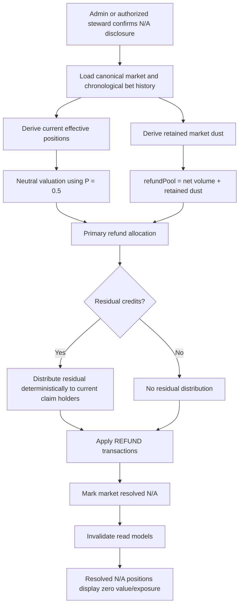

# N/A Neutral Unwind Refunds Design

## Design Posture

This feature follows the accounting and cache-boundary rules already established in the design plan and read-model notes:

- Resolution/refund is transaction-critical and must not use cached display snapshots.
- Raw market bet history remains the audit source of truth.
- Display read models may show `N/A` state, but must not decide refund amounts.
- The refund algorithm must conserve money and be deterministic.
- Position invalidation should be resolution-aware derivation, not destructive historical mutation.

## Domain Language

| Term | Meaning |
| --- | --- |
| `N/A` resolution | Governance decision that the market contract should not resolve to either binary side. |
| Neutral unwind | Refund valuation convention that treats the binary market as neutral `P = 0.5` for refund accounting only. |
| Refund pool | Retained market value available for refund, including retained dust. |
| Current claim holder | User with effective remaining exposure after replaying canonical bet history. |
| Residual dust | Credits left after integer refund allocation. |
| Position invalidation | Resolution-aware rule that voided markets no longer count as live user holdings. |

## Boundary Decision

`N/A` is not a third tradable outcome and not a probability.

```text
Display outcome: N/A / ?
Refund valuation: neutral binary P = 0.5
Trading state: closed/resolved, not tradable
Portfolio state: zero effective exposure after refund
```

## Moderator/Admin Disclosure Boundary

The current backend resolution boundary accepts `N/A`, but the frontend resolution modal only exposes ordinary binary outcomes. The frontend implementation slice must add an explicit `N/A` resolution path for authorized moderators/admins and must require a confirmation disclosure before the request is submitted.

The disclosure is part of the governance boundary, not just UX copy. A moderator or admin should not be able to accidentally void a market while thinking they are selecting a third payout outcome.

The disclosure must communicate:

- `N/A` voids the market rather than resolving it directionally.
- Neutral `P = 0.5` is refund accounting only.
- No winner payout is made.
- No moderator work profit is paid.
- Market creation/proposal cost is not refunded.
- Prior sale proceeds are not clawed back.
- Remaining positions become zero effective exposure.
- The action is irreversible and auditable.

## High-Level Flow



## Refund Pool

The refund pool should be derived from canonical history:

```text
refundPool = GetMarketVolumeWithDust(canonicalBets)
```

This aligns with the current dust-conservation model:

```text
VolumeWithDust = plain net volume + retained market dust
```

The implementation must validate:

```text
refundPool >= 0
sum(appliedRefunds) == refundPool
```

If either condition fails, the resolution should fail before mutating balances.

## Neutral Position Valuation

The algorithm should not value claims using the market's current probability. That would endorse a price produced by a market that is being voided.

Instead, for refund accounting only:

```text
neutralProbability = 0.5
```

Implementation options:

| Option | Notes |
| --- | --- |
| Reuse DBPM position path with resolution probability override | Preferred if the existing path can accept an explicit neutral resolution without corrupting normal payout behavior. |
| Build dedicated neutral-unwind calculator | Preferred if the existing payout code is too tightly coupled to ordinary `YES`/`NO` resolution. |

Either option must preserve raw bet history and keep the neutral valuation local to `N/A` refund calculation.

## Residual Allocation

Integer accounting can leave residual credits after neutral valuation. Residual allocation must be deterministic.

Recommended baseline:

1. Only current claim holders are eligible.
2. Sort eligible users by earliest positive participation timestamp.
3. Tie-break by username ascending.
4. Add one credit at a time until the residual is exhausted.

This does not refund dust to the exact historical dust payor. That is acceptable for the baseline because exact dust-payor attribution is not stored. The policy instead rewards users who still hold risk in the voided market, with earliest current participants receiving deterministic priority.

Users who sold out completely should not receive residual dust refunds because they already exited the market and received sale proceeds.

## Position Invalidation Strategy

Do not write synthetic sell rows just to zero positions. Do not delete bets. Do not mutate historical bets.

Instead, position/read logic should treat `resolutionResult == "N/A"` as a terminal void state:

```text
if market.isResolved && market.resolutionResult == "N/A":
  effective YES shares = 0
  effective NO shares = 0
  effective value = 0
  unresolved exposure = 0
```

Financial history may still show the refund transaction and closed market history, but active/portfolio books should not show live shares.

## Critical Decisions

| Decision | Uses cached/read-model data? | Reason |
| --- | --- | --- |
| N/A refund amount | No | Moves money and must conserve retained pool. |
| Neutral valuation | No | Must derive from canonical market history and explicit policy. |
| Residual dust allocation | No | Moves money and must be deterministic/auditable. |
| Position invalidation | No for canonical position calculation; yes only for display of already-resolved state | Must not leave N/A shares on active books. |
| Market detail display | May use read models after transaction completes | Display-only once resolved. |
| Portfolio/financial display | May use read models after transaction completes | Must show zero effective exposure for N/A markets. |

## Interactions With Existing Features

| Feature | Interaction |
| --- | --- |
| Moderator work profits | `N/A` does not pay work profit. |
| Market stewardship | Current steward/admin may trigger `N/A` if authorized by existing resolution policy. |
| Read-model caching | Resolution must invalidate market, user financial, portfolio, leaderboard, and discovery snapshots. |
| Dust accounting | Retained market dust is included in refund pool but does not affect probability. |
| Sale dust net proceeds | Prior sale proceeds are final; `N/A` must not claw them back. |
| Market creation/proposal cost | Not refunded. |
| Frontend resolution UI | Existing modal exposes `YES`/`NO`; `N/A` requires an added option plus confirmation disclosure. |

## Open Questions

- Should initial participation fees be treated as retained server-side fees and excluded from `N/A`, or should they be voided and included in refund pool if future accounting captures them per market?
- Should `N/A` require admin-only authority, or may current stewards resolve to `N/A` under the same policy as ordinary resolution?
- Should the UI expose the neutral unwind formula in a market audit panel?
- Should exact dust-payor attribution be added later if product requirements demand exact dust refunds?
