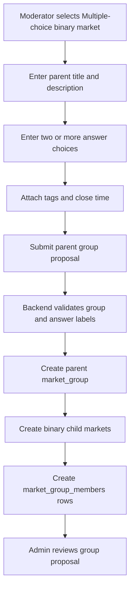
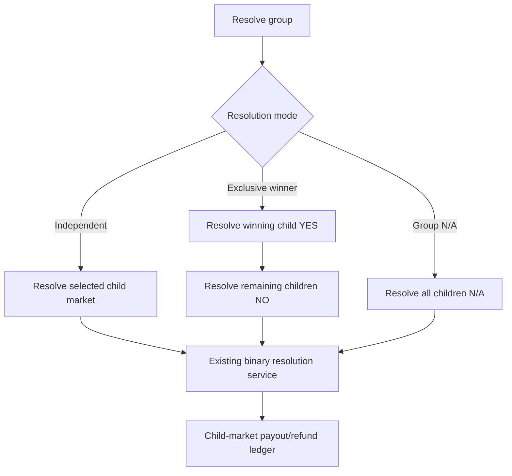

# Multiple Choice Binary Markets Design

## Design Posture

This design keeps SocialPredict's existing binary market math intact. A multiple-choice market is a display and governance grouping of several normal binary markets, not a replacement for the binary market accounting model.

Design rules:

- Keep prediction market math backend-owned.
- Keep buy/sell/sale-dust/resolution/payout paths child-market-scoped and canonical.
- Do not use parent display state to decide transaction outcomes.
- Add new persistence through timestamped Go migrations.
- Treat frontend presentation as an experience layer over backend-owned market group state.
- Keep sum-to-one behavior out of the baseline unless the math and payout model are explicitly redesigned.

## Alternative Considered: True Multi-Asset Market

A second possible architecture is a single market with many outcome assets, where each answer is an asset inside one shared market maker and probabilities are coupled across all answers.

That model is useful when the product requires a true mutually-exclusive multi-outcome market whose answer probabilities are expected to sum to `1.0`. It is not the recommended baseline for SocialPredict because it would require a new order, payout, refund, probability, position, charting, and accounting path instead of reusing the existing binary market path.

The grouped-binary-child design is intentionally more conservative:

- it preserves the current binary transaction math
- it keeps each answer independently auditable
- it avoids introducing a second payout model during the first implementation slice
- it keeps migration risk lower because existing `markets` rows remain the canonical tradable entities

If SocialPredict later needs true coupled multi-outcome markets, that should become a separate market class rather than a hidden behavior inside grouped binary markets.

## Bounded Context Ownership

| Area | Owner | Rule |
| --- | --- | --- |
| Child market trading | Prediction Market Core Context | Existing binary market services own orders, sales, dust, probability, positions, and payout. |
| Parent market group | Prediction Market Core Context | Owns grouping, governance, answer ordering, and parent contract text. |
| Persistence | Backend Persistence and Migration Boundary | Additive timestamped migrations and tests. |
| Frontend display | Frontend Experience Context | Shows grouped child markets as one consolidated market view without inventing market truth. |
| Discovery/read models | Read-model/display boundary | Can cache group cards, answer summaries, and charts, but not transaction decisions. |

## Data Model Direction

Preferred additive schema:

```text
market_groups
  id
  question_title
  description
  group_type = MULTIPLE_CHOICE_BINARY
  probability_policy = INDEPENDENT_BINARY
  resolution_policy = INDEPENDENT_CHILDREN or EXCLUSIVE_HELPER
  lifecycle_status
  proposal_cost
  creator_username
  steward_username
  approved_by / approved_at
  rejected_by / rejected_at / rejection_reason
  resolution_date_time
  created_at / updated_at / deleted_at

market_group_members
  id
  group_id
  market_id
  answer_label
  display_order
  created_at / updated_at / deleted_at
```

Existing `markets` rows remain the canonical trading entities. Each child market should keep `outcome_type = BINARY` so existing math and handlers can continue to work.

Possible child market title convention:

```text
Parent: "Who will win the tournament?"
Answer: "Team A"
Child market title: "Will Team A win the tournament?"
```

Child labels can remain simple:

```text
yes_label = "YES"
no_label = "NO"
```

or use answer-aware display copy on the group page:

```text
answer_label = "Team A"
probability = child YES probability
```

## Probability Policy

Baseline policy: `INDEPENDENT_BINARY`.

| Question | Baseline answer |
| --- | --- |
| Must child probabilities add to `1.0`? | No. |
| Can child probabilities sum above `1.0`? | Yes. |
| Can child probabilities sum below `1.0`? | Yes. |
| Is this misleading? | Only if UI labels imply normalized odds. UI must say each answer is its own YES/NO market. |
| Can exclusive resolution still exist? | Yes, as a helper that resolves child markets using ordinary binary resolution. |

Future policy: `SUM_TO_ONE_EXCLUSIVE`.

This should not be implemented by normalizing display probabilities over independent child markets. It would need a separate design because transaction prices, payout pools, and arbitrage behavior would need to match the displayed sum-to-one semantics.

## Public URL And Display Convention

The parent group can exist as a backend/API concept, but the public UX should default to a normal child market URL.

Preferred convention:

- `/markets/:childMarketId` loads the selected child market.
- If that child belongs to a multiple-choice binary group, the page switches to a consolidated grouped view.
- The consolidated view shows the parent question, parent description, all answer children, a shared comparison chart, and per-answer trade controls.
- `/markets/group/:groupId` can exist as an internal/compatibility route, but it should not be the primary public URL.
- Discovery, search, and topic pages should collapse grouped children into one row that links to a representative child market URL.

Reason:

- The public page should feel like one market to users.
- Child markets remain normal tradable entities behind the view.
- Existing child-market routes keep Open Graph, direct linking, and transaction boundaries simple.

## Creation Flow



Validation:

- parent title follows existing market title length rules
- parent description follows existing description rules
- answer labels follow market label constraints or a new answer-label constraint
- at least two answers are required
- answer labels must be unique after trimming/case normalization
- answer count should use setup-configured guardrails: a soft review threshold for unusually large groups and a hard safety cap for abuse/performance protection
- no answer deletion after approval in the baseline

## Cost Policy

Baseline: charge one group proposal cost at creation time, regardless of the number of initial answers.

Reason:

- A multiple-choice group is one moderator proposal from the participant perspective.
- Charging per initial answer would make thoughtful upfront enumeration expensive and discourage moderators from listing plausible outcomes at creation time.
- Child markets still collect initial participant fees independently when users trade them.
- Later answer additions, if enabled, should charge `multipleChoiceBinary.addAnswerCost` from `setup.yaml` because they expand an already-published governance object.
- Later answer-addition fees should increase the parent group proposal-cost threshold so the steward only earns work profit after participant fees exceed the total cost paid to create and expand the group.

Configured policy:

- `economics.marketincentives.multipleChoiceBinary.addAnswerCost`: credit cost for later answer additions after the group exists.
- `economics.marketincentives.multipleChoiceBinary.softAnswerReviewThreshold`: review/usability warning threshold, not a hard product claim about possible real-world outcomes.
- `economics.marketincentives.multipleChoiceBinary.hardAnswerSafetyCap`: operational cap for abuse and computational safety, not a philosophical maximum on possible answers.

## Work Profit Policy

Normal binary markets already derive moderator work profit at resolution time. The first-entry participant fee is collected when a user first trades a market, but it is not immediately paid to the market creator. On non-`N/A` resolution, surplus participant fees above the market proposal-cost threshold are paid as `WORK_PROFIT` to the current steward, falling back to the creator if no steward is assigned.

Multiple-choice binary groups should mirror that accounting at the group level:

- child market bettor payouts remain per child market
- child markets inside a group must not independently pay child work profit
- participant fee income counts each unique participant once across the whole group
- group work profit is paid once, after group resolution, to the current group steward
- group work profit uses the parent group proposal cost as the threshold

## Governance And Review

Group proposal review should be the admin-facing unit of approval.

Admin review should show:

- parent title
- parent description/amendments
- answer labels
- generated child market titles
- tags
- creator
- steward
- proposal cost
- resolution policy
- probability policy

Approve group:

- publishes parent group
- publishes child markets together
- makes group visible in discovery

Reject group:

- rejects parent group
- rejects or cancels generated child markets
- refunds group proposal cost under existing proposal refund rules

Stewardship:

- parent group has a current steward
- child markets should default to the same steward
- reassignment should update parent and children together unless a future design allows split stewardship

Admin and moderator review queues should collapse grouped child markets into one group listing.

Grouped queue rows should show:

- parent title and parent description
- child answer labels and child market IDs
- tags inherited by the children
- creator and steward
- lifecycle status
- audit trail
- group-level amendment state

Approve/reject actions should be group-level actions when a group is still proposed. Admins should not need to approve or reject each generated child market one by one.

Moderator views should similarly group Proposed, Published, and Rejected rows so the creator/steward can understand the state of the grouped market as one feature.

## Group Amendments

The amendment model remains append-only and backend-owned.

For grouped binary markets, the baseline should support group-level amendment visibility:

- parent group page shows approved group amendments
- admin review shows pending/approved/rejected group amendments with child market context
- moderator profile views show pending/approved/rejected group amendments for groups they steward
- child market pages can show a link back to the parent group when group amendment context matters

Open implementation decision:

- whether group amendments are persisted as parent-only amendment rows, child-specific amendment rows attached to each generated market, or a dedicated group amendment table

The design preference is parent-owned group amendments with child-market transaction state unchanged. Any child-specific amendment behavior should be a later explicit design, because child-specific contract changes could alter the meaning of a single answer independently from the group.

## Resolution

Baseline resolution modes:

| Mode | Behavior |
| --- | --- |
| Independent child resolution | Steward/admin resolves each child YES/NO/N/A separately. |
| Exclusive helper | Steward/admin chooses one winning answer; backend resolves that child YES and all other children NO through ordinary child-market resolution. |
| Group N/A | Steward/admin marks the whole group N/A; backend resolves each child N/A through ordinary child-market refund logic. |

Critical rule: parent group resolution never bypasses child market payout/refund services.

Exclusive helper rules:

- "Only one answer can resolve YES" is a group policy, not a probability policy.
- "After one answer resolves YES, all others resolve NO, and not sooner" means non-winning children stay tradable/unresolved until the exclusive helper is executed.
- The helper should call the existing child-market resolution service for the winning child and every remaining child.
- The helper must be idempotent or reject partial/inconsistent resolution state before mutating payouts.



## Answer Addition Policy

Future grouped markets may allow additional answer choices after initial creation. The baseline should design for this as an explicit policy instead of leaving it implicit.

Candidate policy enum:

| Policy | Meaning |
| --- | --- |
| `NO_ONE` | No new answers can be added after approval. |
| `CREATOR_ONLY` | Only the original creator/current steward can propose new answers. |
| `ANY_ACTIVE_MODERATOR` | Any active moderator can propose new answers. |

Admin control:

- answer additions are disabled by default
- admins can enable the policy per group or through a future game/config setting
- added answers must be proposed by an active moderator
- added answers should go through review unless a future auto-approval rule is explicitly designed
- market creator/steward gating should remain visible in the audit trail

Transaction boundary:

- adding an answer creates another normal child binary market
- adding an answer must not rewrite existing child market bets, probability history, dust, or payouts
- existing answer children remain canonical for trades already placed

## Read Models And Discovery

Group read models can include:

- parent group summary
- ordered answer summaries
- child market IDs
- child probabilities
- child volumes
- child user counts
- compact child chart snapshots
- freshness metadata

Read models may support:

```text
GET /v0/read/market-groups/{id}
GET /v0/read/market-groups/{id}/answers
GET /v0/read/market-discovery/groups
```

Transaction endpoints remain child-market endpoints:

```text
POST /v0/bet          with child market_id
POST /v0/sell         with child market_id
POST /v0/markets/{id}/resolve for child or service-internal child resolution
```

## Frontend Surface

Routes:

| Route | Purpose |
| --- | --- |
| `/markets/:id` | Existing child binary market detail page remains valid and renders the consolidated group view when the child belongs to a group. |
| `/markets/group/:id` | Compatibility route only; should redirect to a representative child market URL. |
| `/create` | Adds market type selector. |
| `/admin` Market Review | Adds grouped proposal review. |

Consolidated child-page layout:

- parent title and contract text
- clear independent-binary explanation
- answer list/cards ordered by display order
- one comparison chart across answer YES probabilities
- trade entry per answer using existing child market transaction controls
- future tabs for group activity, child markets, amendments, and resolution status

## Critical Decisions

| Decision | Baseline |
| --- | --- |
| Market class | Add parent market group with binary child markets. |
| Probability sum | Do not require probabilities to add to `1.0`. |
| Child math | Reuse existing WPAM/DBPM binary math. |
| Payout | Execute existing child-market payout/refund paths. |
| Resolution | Resolve child markets; group helpers orchestrate child resolutions. |
| Cost | Charge one group proposal cost for initial answers; price later additions through setup policy if enabled. |
| Tags | Parent tags drive discovery; child projection supports search/filter if needed. |
| Read models | Cache display payloads only; transaction paths remain canonical. |
| Migrations | Additive timestamped Go migrations with tests where practical. |

## Risks

| Risk | Mitigation |
| --- | --- |
| Users assume probabilities add to 100%. | Prominent copy: each answer is its own YES/NO market. |
| Group resolution accidentally bypasses payout rules. | Group resolution service must call existing child resolution paths and have tests. |
| Child markets appear as duplicate noise in `/markets`. | Discovery should prefer group cards and optionally hide child markets from top-level lists unless explicitly searched. |
| Answer edits after trading change the contract. | Answer labels immutable after approval; use amendments for parent description clarifications. |
| Per-child proposal costs make groups impractical. | Include initial answers in one group proposal cost; use setup-configured soft/hard answer guardrails for abuse and usability. |
| Future sum-to-one display drifts from payout math. | Defer until a distinct coupled market design exists. |

## Open Questions

- Should group pages hide direct child market pages from normal navigation while preserving direct URLs?
- Should an exclusive group require admin/steward to resolve every child in one transaction?
- Should parent and child descriptions be identical, or should children have generated descriptions that reference the parent contract?
- Should child market tags be copied at approval time or projected dynamically from the parent group?
- Should later answer additions increase parent proposal cost immediately, or only after admin approval?
