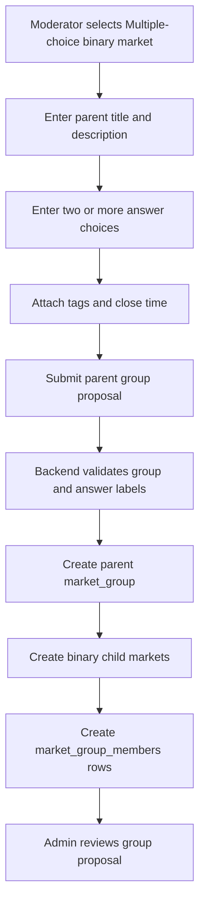
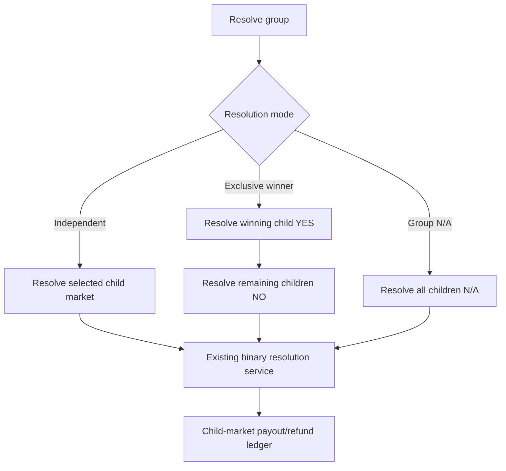

# Multiple Choice Binary Markets Design

## Design Posture

This design keeps SocialPredict's existing binary market math intact. A multiple-choice market is a display and governance grouping of several normal binary markets, not a replacement for the binary market accounting model.

Design rules:

- Keep prediction market math backend-owned.
- Keep buy/sell/sale-dust/resolution/payout paths child-market-scoped and canonical.
- Do not use parent display state to decide transaction outcomes.
- Add new persistence through timestamped Go migrations.
- Treat frontend presentation as an experience layer over backend-owned market group state.
- Keep sum-to-one behavior out of the baseline unless the math and payout model are explicitly redesigned.

## Bounded Context Ownership

| Area | Owner | Rule |
| --- | --- | --- |
| Child market trading | Prediction Market Core Context | Existing binary market services own orders, sales, dust, probability, positions, and payout. |
| Parent market group | Prediction Market Core Context | Owns grouping, governance, answer ordering, and parent contract text. |
| Persistence | Backend Persistence and Migration Boundary | Additive timestamped migrations and tests. |
| Frontend display | Frontend Experience Context | Shows group and child markets without inventing market truth. |
| Discovery/read models | Read-model/display boundary | Can cache group cards, answer summaries, and charts, but not transaction decisions. |

## Data Model Direction

Preferred additive schema:

```text
market_groups
  id
  question_title
  description
  group_type = MULTIPLE_CHOICE_BINARY
  probability_policy = INDEPENDENT_BINARY
  resolution_policy = INDEPENDENT_CHILDREN or EXCLUSIVE_HELPER
  lifecycle_status
  proposal_cost
  creator_username
  steward_username
  approved_by / approved_at
  rejected_by / rejected_at / rejection_reason
  resolution_date_time
  created_at / updated_at / deleted_at

market_group_members
  id
  group_id
  market_id
  answer_label
  display_order
  created_at / updated_at / deleted_at
```

Existing `markets` rows remain the canonical trading entities. Each child market should keep `outcome_type = BINARY` so existing math and handlers can continue to work.

Possible child market title convention:

```text
Parent: "Who will win the tournament?"
Answer: "Team A"
Child market title: "Will Team A win the tournament?"
```

Child labels can remain simple:

```text
yes_label = "YES"
no_label = "NO"
```

or use answer-aware display copy on the group page:

```text
answer_label = "Team A"
probability = child YES probability
```

## Probability Policy

Baseline policy: `INDEPENDENT_BINARY`.

| Question | Baseline answer |
| --- | --- |
| Must child probabilities add to `1.0`? | No. |
| Can child probabilities sum above `1.0`? | Yes. |
| Can child probabilities sum below `1.0`? | Yes. |
| Is this misleading? | Only if UI labels imply normalized odds. UI must say each answer is its own YES/NO market. |
| Can exclusive resolution still exist? | Yes, as a helper that resolves child markets using ordinary binary resolution. |

Future policy: `SUM_TO_ONE_EXCLUSIVE`.

This should not be implemented by normalizing display probabilities over independent child markets. It would need a separate design because transaction prices, payout pools, and arbitrage behavior would need to match the displayed sum-to-one semantics.

## Creation Flow



Validation:

- parent title follows existing market title length rules
- parent description follows existing description rules
- answer labels follow market label constraints or a new answer-label constraint
- at least two answers are required
- answer labels must be unique after trimming/case normalization
- maximum answer count should be bounded, likely reusing or adapting a `MAX_ANSWERS` constant
- no answer deletion after approval in the baseline

## Cost Policy

Recommended baseline: charge one group proposal cost, not one full market creation cost per child.

Reason:

- A multiple-choice group is one moderator proposal from the participant perspective.
- Charging per child answer would make normal multiple-choice questions expensive and discourage use.
- Child markets still collect initial participant fees independently when users trade them.

Open decision:

- Whether group proposal cost should scale modestly with answer count to discourage spam.

## Governance And Review

Group proposal review should be the admin-facing unit of approval.

Admin review should show:

- parent title
- parent description/amendments
- answer labels
- generated child market titles
- tags
- creator
- steward
- proposal cost
- resolution policy
- probability policy

Approve group:

- publishes parent group
- publishes child markets together
- makes group visible in discovery

Reject group:

- rejects parent group
- rejects or cancels generated child markets
- refunds group proposal cost under existing proposal refund rules

Stewardship:

- parent group has a current steward
- child markets should default to the same steward
- reassignment should update parent and children together unless a future design allows split stewardship

## Resolution

Baseline resolution modes:

| Mode | Behavior |
| --- | --- |
| Independent child resolution | Steward/admin resolves each child YES/NO/N/A separately. |
| Exclusive helper | Steward/admin chooses one winning answer; backend resolves that child YES and all other children NO through ordinary child-market resolution. |
| Group N/A | Steward/admin marks the whole group N/A; backend resolves each child N/A through ordinary child-market refund logic. |

Critical rule: parent group resolution never bypasses child market payout/refund services.



## Read Models And Discovery

Group read models can include:

- parent group summary
- ordered answer summaries
- child market IDs
- child probabilities
- child volumes
- child user counts
- compact child chart snapshots
- freshness metadata

Read models may support:

```text
GET /v0/read/market-groups/{id}
GET /v0/read/market-groups/{id}/answers
GET /v0/read/market-discovery/groups
```

Transaction endpoints remain child-market endpoints:

```text
POST /v0/bet          with child market_id
POST /v0/sell         with child market_id
POST /v0/markets/{id}/resolve for child or service-internal child resolution
```

## Frontend Surface

Routes:

| Route | Purpose |
| --- | --- |
| `/markets/group/:id` | Parent multiple-choice page. |
| `/markets/:id` | Existing child binary market detail page remains valid. |
| `/create` | Adds market type selector. |
| `/admin` Market Review | Adds grouped proposal review. |

Group page layout:

- parent title and contract text
- clear independent-binary explanation
- answer list/cards ordered by display order
- probability/charts per answer
- trade entry per answer, either inline or via child detail panel
- tabs for group activity, child markets, and resolution status

## Critical Decisions

| Decision | Baseline |
| --- | --- |
| Market class | Add parent market group with binary child markets. |
| Probability sum | Do not require probabilities to add to `1.0`. |
| Child math | Reuse existing WPAM/DBPM binary math. |
| Payout | Execute existing child-market payout/refund paths. |
| Resolution | Resolve child markets; group helpers orchestrate child resolutions. |
| Cost | Charge one group proposal cost in baseline. |
| Tags | Parent tags drive discovery; child projection supports search/filter if needed. |
| Read models | Cache display payloads only; transaction paths remain canonical. |
| Migrations | Additive timestamped Go migrations with tests where practical. |

## Risks

| Risk | Mitigation |
| --- | --- |
| Users assume probabilities add to 100%. | Prominent copy: each answer is its own YES/NO market. |
| Group resolution accidentally bypasses payout rules. | Group resolution service must call existing child resolution paths and have tests. |
| Child markets appear as duplicate noise in `/markets`. | Discovery should prefer group cards and optionally hide child markets from top-level lists unless explicitly searched. |
| Answer edits after trading change the contract. | Answer labels immutable after approval; use amendments for parent description clarifications. |
| Per-child proposal costs make groups impractical. | Charge one group proposal cost at baseline; revisit abuse controls later. |
| Future sum-to-one display drifts from payout math. | Defer until a distinct coupled market design exists. |

## Open Questions

- Should group pages hide direct child market pages from normal navigation while preserving direct URLs?
- Should an exclusive group require admin/steward to resolve every child in one transaction?
- Should parent and child descriptions be identical, or should children have generated descriptions that reference the parent contract?
- Should child market tags be copied at approval time or projected dynamically from the parent group?
- What maximum answer count is appropriate for performance and UI clarity?
