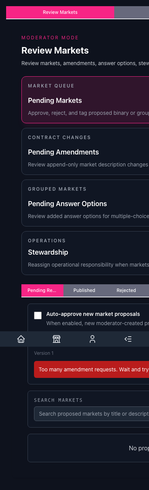
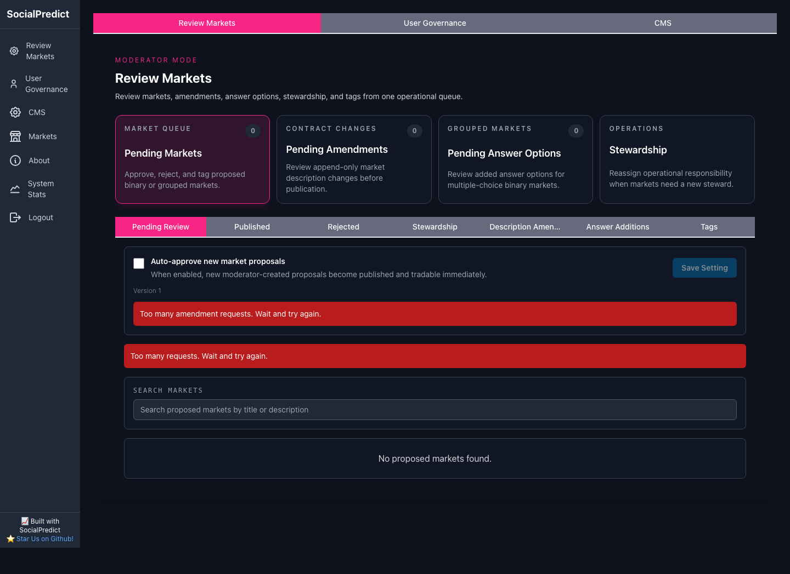
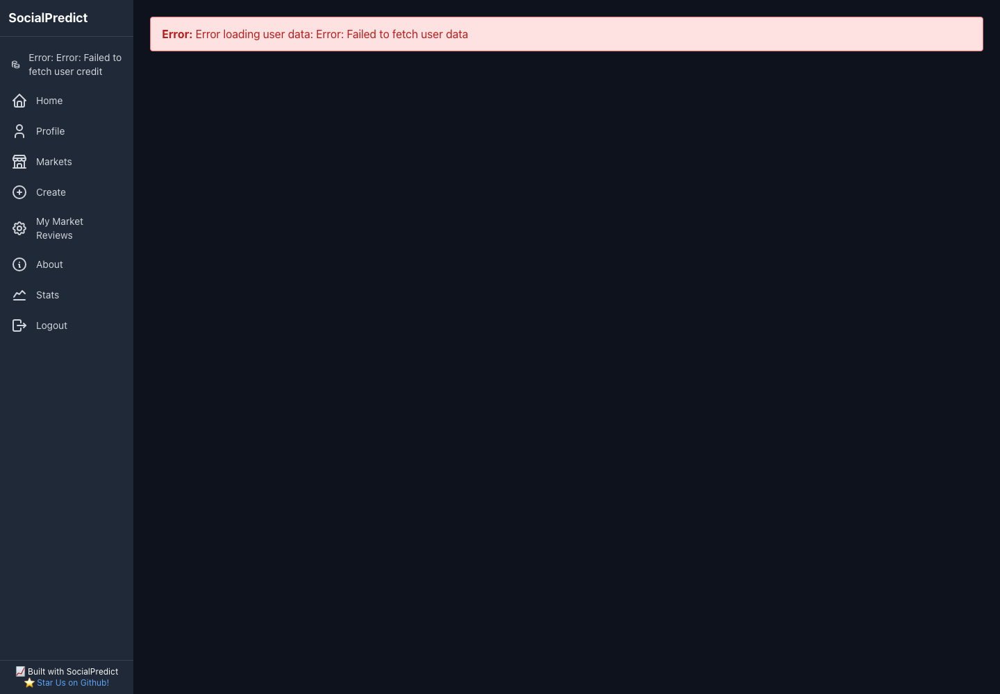
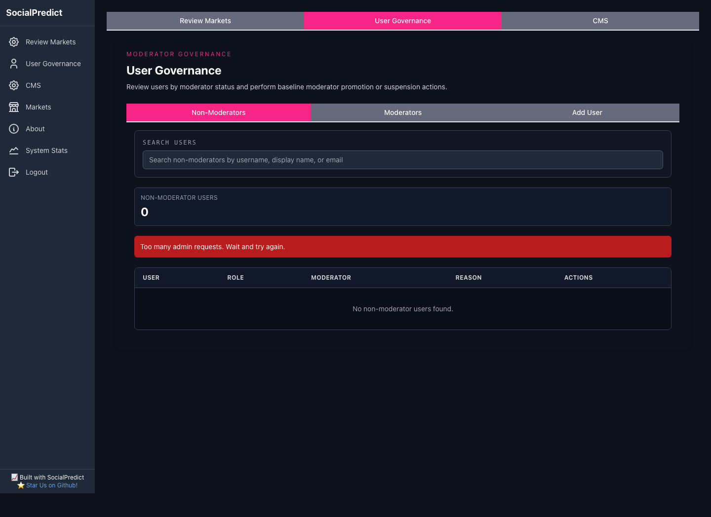
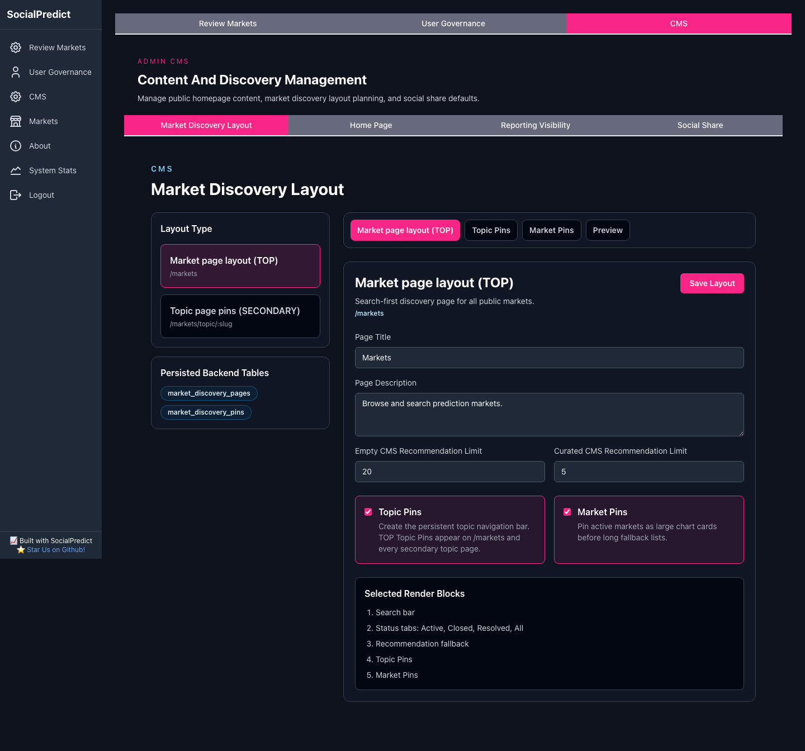
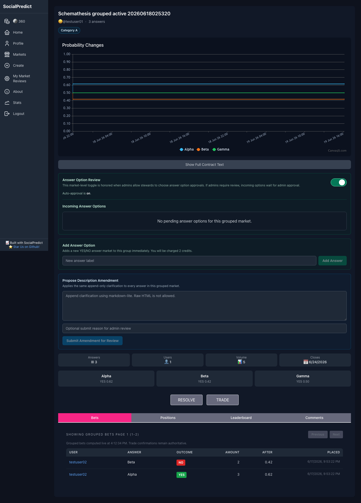
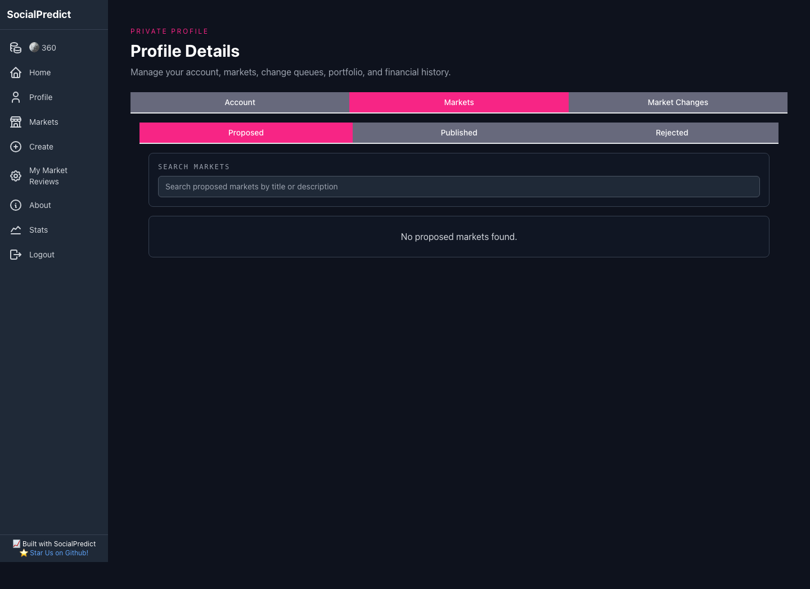
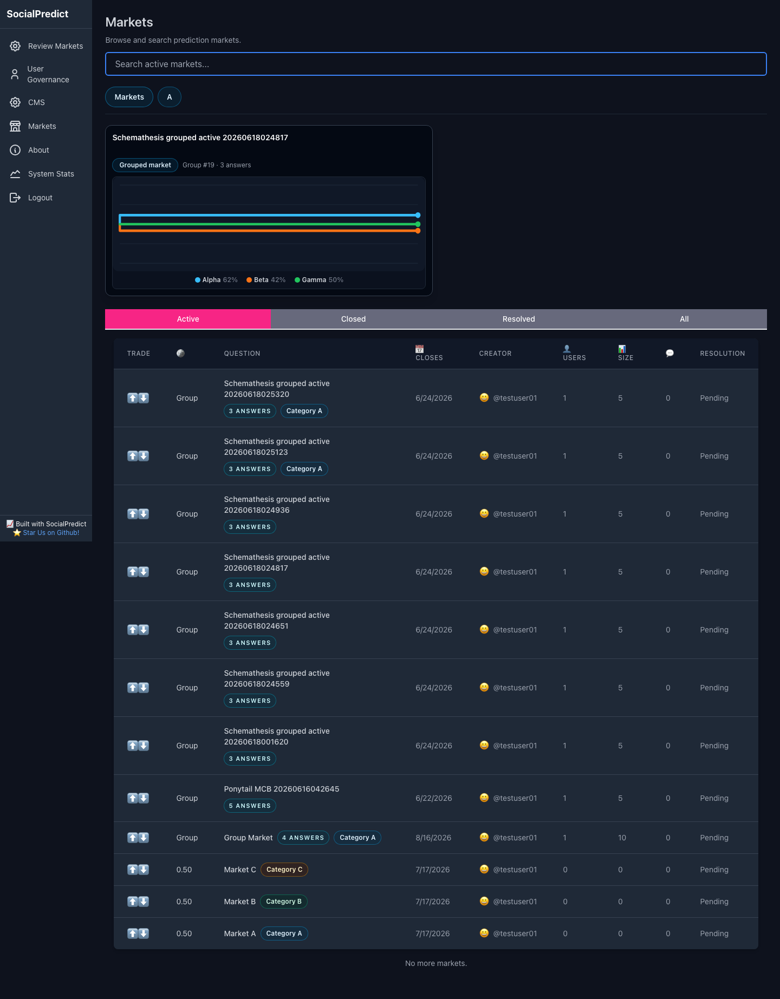
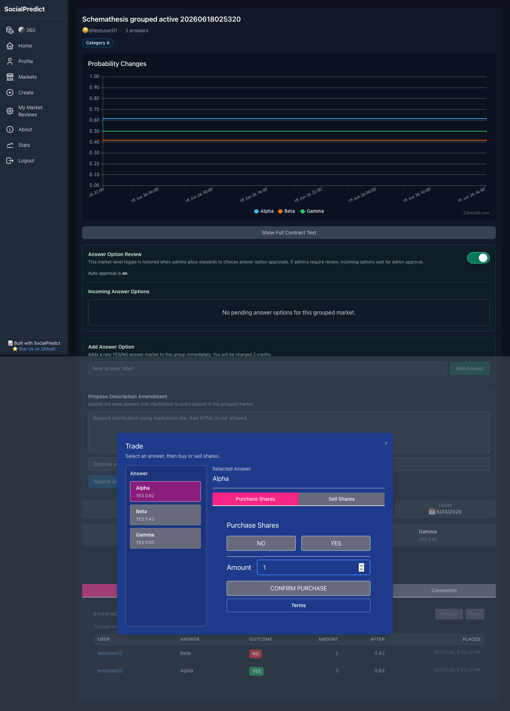

# SocialPredict UI Audit

Date: 2026-06-19

Local endpoints tested:

- Frontend: `http://localhost:5173`
- Backend API: `http://localhost:8080`
- Admin fixture login: `admin` / `password`
- Moderator fixture login: `testuser01` / `password`

This audit used a local Playwright/Chromium pass to navigate the public market pages, admin review pages, CMS layout editor, profile page, and grouped-market detail/trading flow. The broad scripted pass intentionally moved faster than a human user, so some screenshots show rate-limit noise. Focused reruns were captured for pages where the broad pass produced transient errors.

## Screenshot Index

| Screenshot | Notes |
| --- | --- |
| [markets-desktop.png](./markets-desktop.png) | Public `/markets` desktop view with grouped market pin and active market list. |
| [topic-debug.png](./topic-debug.png) | Focused steady-state `/markets/topic/category-a` run. |
| [topic-category-a-desktop.png](./topic-category-a-desktop.png) | Broad-pass topic page with transient fetch error from rapid navigation. |
| [topic-category-a-mobile.png](./topic-category-a-mobile.png) | Mobile topic page broad-pass state. |
| [admin-review.png](./admin-review.png) | Admin review queue desktop broad pass. |
| [admin-review-mobile.png](./admin-review-mobile.png) | Admin review queue mobile layout. |
| [admin-tags.png](./admin-tags.png) | Admin market-tags tab broad pass. |
| [admin-cms-debug.png](./admin-cms-debug.png) | Focused steady-state CMS Market Discovery run. |
| [admin-cms.png](./admin-cms.png) | CMS Market Discovery broad pass. |
| [admin-cms-market-pins-after-click.png](./admin-cms-market-pins-after-click.png) | Broad-pass post-click artifact while navigating CMS/admin tabs. |
| [admin-users.png](./admin-users.png) | User Governance broad pass. |
| [profile-debug.png](./profile-debug.png) | Focused steady-state moderator profile run. |
| [profile-moderator.png](./profile-moderator.png) | Moderator profile broad-pass transient error state. |
| [group-market-detail.png](./group-market-detail.png) | Focused grouped-market detail page. |
| [group-market-trade.png](./group-market-trade.png) | Focused grouped-market trade modal. |

## Findings

1. Mobile admin pages clip horizontally.

The admin review screen on mobile is wider than the viewport. Tab labels and content are cut off instead of wrapping, stacking, or scrolling cleanly. See [admin-review-mobile.png](./admin-review-mobile.png).

2. Admin review has too many navigation layers.

The admin area currently has a sidebar, top admin tabs, shortcut cards, and an inner review tab bar. The inner tab label `Description Amen...` truncates, which makes the destination less clear. See [admin-review.png](./admin-review.png).

3. Fast navigation can surface noisy rate-limit errors.

The broad scripted pass triggered visible `Too many admin requests`, `Too many amendment requests`, and related transient errors. Focused reruns loaded the same pages successfully. This suggests request clustering/rate-limit sensitivity rather than missing data, but the user-facing errors are alarming and sometimes appear in panels unrelated to the current task.

4. CMS Market Discovery is implementation-heavy.

The CMS layout editor shows internal concepts such as `Persisted Backend Tables`, `Selected Render Blocks`, `TOP`, and `SECONDARY`. These are useful for developers, but they make the admin UI less intuitive. See [admin-cms-debug.png](./admin-cms-debug.png).

5. Grouped-market steward controls appear before the core trading area.

For a steward/moderator, `Answer Option Review`, `Add Answer Option`, and `Propose Description Amendment` appear before the stats and trade controls. This makes the page feel governance-first instead of market-first. Consider collapsing these into a `Market Governance` section or moving them below the main trading panel. See [group-market-detail.png](./group-market-detail.png).

6. Profile can default to an empty proposed-markets view.

The focused moderator profile run landed on `Markets > Proposed` with no proposed markets. That is a low-information default. Account, Published Markets, Portfolio, or a last-used tab may be more useful. See [profile-debug.png](./profile-debug.png).

7. The market list coin column is ambiguous for grouped markets.

The `🪙` column displays `Group` for grouped markets, while binary markets display a probability. This mixes type and price/probability in the same column. Consider moving the grouped indicator fully into the question area or renaming the column. See [markets-desktop.png](./markets-desktop.png).

8. The grouped-market trade modal is usable, but dense.

The grouped trade modal is a major improvement over overlapping tabs, but it still asks the user to parse answer selection, YES/NO direction, amount, confirm, and terms in one dense panel. It may benefit from stronger visual hierarchy between answer choice and trade side. See [group-market-trade.png](./group-market-trade.png).

## Recommended Next Fixes

1. Fix mobile admin clipping.
2. Simplify CMS admin-facing language and hide developer-only implementation details.
3. Move grouped-market governance controls into a collapsible section.
4. Reduce or quiet background admin request rate-limit noise.
5. Improve default profile landing behavior.
